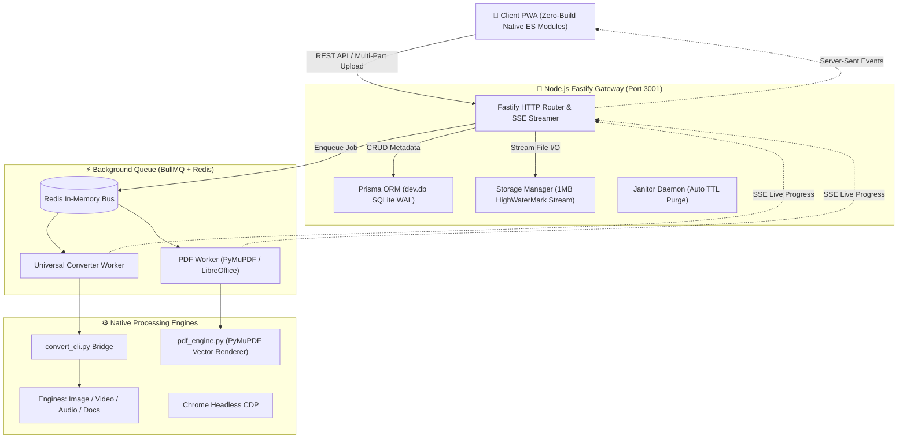

<div align="center">

# ⚡ DuyDev Studio (DS)
### Personal Self-Hosted Utility Hub & High-Performance File Processing Suite

[](https://duydevstudio.alphadaniel.io.vn)
[](https://duydevstudio.alphadaniel.io.vn)
[](https://nodejs.org/)
[](https://fastify.dev/)
[](https://www.typescriptlang.org/)
[](https://www.python.org/)
[](https://vitest.dev/)
[](LICENSE)

<p align="center">
  <b>Trang sản phẩm trực tiếp (Production):</b> <br/>
  🌐 <a href="https://duydevstudio.alphadaniel.io.vn">https://duydevstudio.alphadaniel.io.vn</a> (Cloudflare Tunnel) <br/>
  🏠 <code>http://192.168.2.171:3000</code> (LAN Homeserver)
</p>

</div>

---

## 📌 Giới thiệu Tổng quan (Overview)

**DuyDev Studio (DS)** là nền tảng trung tâm tiện ích cá nhân tự lưu trữ (Self-Hosted Personal Utility Suite) được xây dựng theo chuẩn **Progressive Web App (PWA)** kết hợp ngôn ngữ thiết kế **Deep Tech Utility** (Linear/Vercel standard).

Hệ thống được thiết kế hướng tới hiệu năng tối đa:
- **Frontend Zero-Build Native ES Modules**: Chạy trực tiếp trên trình duyệt mà không cần bước bundler cồng kềnh (không webpack/vite ở client), nạp mô-đun tức thời qua native ES imports.
- **Backend Gateway Siêu Tốc**: Node.js Fastify với buffer stream 1MB (`highWaterMark`), BullMQ trên Redis, SQLite WAL qua Prisma ORM.
- **Động cơ Đa Ngôn ngữ (Polyglot Engines)**: Tận dụng sức mạnh native của C/Python (PyMuPDF, LibreOffice headless, FFmpeg, pdf2docx, Pillow) phục vụ xử lý tài liệu và đa phương tiện.

---

## 🚀 Các Mô-đun Cốt Lõi (Core Features)

### 1. 📄 PDF Studio Pro (9 Công cụ Chuyên nghiệp)
- **Ghép PDF (Merge)**: Nối không giới hạn tệp PDF với cơ chế kéo thả đổi thứ tự mượt mà.
- **Tách trang (Split)**: Lưới trực quan 8 thumbnail (4×2) kèm phóng to Lightbox toàn màn hình, chọn nhanh trang chẵn/lẻ hoặc nhập dải trang (`1-3, 5, 8-10`).
- **Xoay trang (Rotate)**: Xoay trực quan $90^\circ, 180^\circ, 270^\circ$ từng trang đơn lẻ hoặc toàn bộ tài liệu trực tiếp trên canvas.
- **Ảnh sang PDF (Images to PDF)**: Tự động căn giữa khổ giấy A4 (595×842 pt), giữ nguyên tỷ lệ khung hình.
- **Nén PDF (Compress)**: 3 cấp độ (Cao, Cân bằng, Nhẹ) với thuật toán bảo toàn nếu tệp đã tối ưu sẵn.
- **Trích ảnh (Extract Images)**: Trích xuất toàn bộ ảnh nhúng nguyên bản chất lượng cao đóng gói file `.zip`.
- **Xem PDF nội tuyến (View)**: Tích hợp đầy đủ phông chữ chuẩn (`standard_fonts`) và CJK CMap (`cmaps`) không lỗi ký tự.
- **Watermark (Đóng dấu)**: Đóng dấu văn bản chéo trang hoặc đánh số trang tự động (`Trang X/N`).
- **Bảo mật (Security)**: Mã hóa tài liệu chuẩn AES-128/256 và mở khóa bảo mật.

### 2. 🔄 Universal File Converter Pro (65+ Định dạng)
- **Hộp nhóm định dạng thích ứng (Grouped Format Boxes)**: Tự động gom các tệp cùng đuôi vào một hộp điều khiển chung kèm ngăn thả tệp thu gọn (`details/summary`). Khi xóa hết tệp nhóm, hộp biến mất tự động.
- **Tải lên ngầm tức thì (Background Eager Upload)**: Tệp được stream lên máy chủ ngay khi thả vào Dropzone. Khi bấm "Chuyển đổi", thời gian chờ upload bằng **0 giây**.
- **Ma trận tương thích thông minh**: Tự động nhận diện phần mở rộng tệp và lọc ra danh sách định dạng đích tương thích thực tế, highlight định dạng tối ưu.
- **Đa danh mục**:
  - *Hình ảnh*: WebP, PNG, JPG, BMP, TIFF, ICO.
  - *Video & Âm thanh*: MP4, WebM, GIF, MP3, WAV, AAC, FLAC, OGG, M4A.
  - *Tài liệu & Dữ liệu*: PDF, DOCX, TXT, HTML, Markdown, CSV, XLSX.
  - *Lưu trữ*: ZIP, TAR, 7Z, GZ.

### 3. 📱 Dynamic QR Studio & VietQR EMVCo
- **Mã QR Động (/q/:slug)**: Rút gọn liên kết tự động, theo dõi phân tích lượt quét (scan telemetry, User-Agent, mốc thời gian thực).
- **VietQR EMVCo Chuẩn Quốc Gia**: Tạo mã QR thanh toán liên ngân hàng Napas 24/7 với tính toán kiểm tra CRC16-CCITT chuẩn xác.
- **Danh Bạ vCard 3.0 Đa Ngôn Ngữ**: Khai báo rõ ràng `;CHARSET=UTF-8` và cấu trúc trường `N;CHARSET=UTF-8:Họ;Tên;Đệm;;`, triệt tiêu lỗi font tiếng Việt trên Xiaomi, HyperOS, ColorOS và iOS.
- **Trình Quét & Giải Mã**: Nhận diện tức thời qua BarcodeDetector API client-side kết hợp backend Sharp + jsQR fallback.

### 4. 🗄️ Trình Quản trị Lưu trữ (Storage Manager) & Zero-Extraction Archive
- **Zero-Extraction Archive Inspector**: Đọc cấu trúc tệp nén `.zip`, `.rar`, `.7z` cực nhanh thông qua kỹ thuật Central Directory seeking mà không cần giải nén bung toàn bộ tệp ra ổ đĩa.
- **Quản lý Lưu trữ Máy chủ**: Duyệt cây thư mục, tạo folder, đổi tên, tải xuống thư mục dạng ZIP và phân tích dung lượng ổ cứng.
- **Dọn dẹp Tự động (Janitor Service)**: Quét và thu hồi các tệp tạm, chunk upload dở dang sau mỗi 15 phút.

### 5. 👁️ Universal File Viewer Core
Trình xem tệp nhúng trực tiếp đa năng:
- **Tài liệu Word**: Xuất `.docx` trực tiếp trên client với `docx-preview`.
- **Bảng tính Excel**: Xuất `.xlsx`, `.csv`, `.tsv` thành bảng Tailwind tương tác với `SheetJS`.
- **Mã nguồn & Văn bản**: Highlight cú pháp đa ngôn ngữ kèm chế độ xem Markdown kép.
- **Tệp Nhị phân**: Chế độ Hex Dump inspector 16KB (Offset | Hex | ASCII).

### 6. 🛡️ Hệ Thống Thông Báo Thông Minh (Anti-Spam Toast Manager)
- Khống chế cứng tối đa 3 popup đồng thời (FIFO Eviction).
- Tự động gộp các thông báo trùng lặp với huy hiệu đếm số lượng (`Đã chuyển vào thùng rác ×5`), triệt tiêu hiện tượng tràn màn hình và khóa click.
- Nút đóng nhanh `×` và giải phóng `pointer-events` tức thời.

---

## 🏗️ Kiến Trúc Hệ Thống (Architecture)



---

## 🛠️ Công Nghệ Sử Dụng (Tech Stack)

| Tầng (Layer) | Công nghệ chính |
| :--- | :--- |
| **Frontend PWA** | Vanilla JavaScript (ES2022+ Native Modules), Tailwind CSS, Lucide Icons, PDF.js, SheetJS, docx-preview, qr-code-styling |
| **Backend Gateway** | Node.js v20+, Fastify v4, TypeScript, Zod Schema Validation |
| **Database & Cache** | SQLite (WAL Mode), Prisma ORM, Redis (BullMQ Queue & Pub/Sub) |
| **Xử lý Tài liệu** | Python 3.11+, PyMuPDF (fitz), LibreOffice Headless, pdf2docx, python-docx |
| **Đa phương tiện** | FFmpeg, Pillow (PIL), Sharp |
| **Testing** | Vitest (33 test files, 337 tests passed 100%) |
| **Triển khai** | Systemd, PM2, Cloudflare Tunnel |

---

## 💻 Hướng Dẫn Cài Đặt & Chạy Cục Bộ (Getting Started)

### 1. Yêu cầu hệ thống (Prerequisites)
- **Node.js**: `v20.x` trở lên
- **Python**: `3.10+` (khuyến nghị 3.11)
- **Redis Server**: Đang chạy tại `127.0.0.1:6379`
- **Công cụ phụ trợ** (tùy chọn để đầy đủ tính năng): `ffmpeg`, `libreoffice`

### 2. Cài đặt mã nguồn

```bash
# Clone repository
git clone https://github.com/anhduyalpha/DuyDev-Studio.git
cd DuyDev-Studio

# 1. Cài đặt dependencies cho Backend Fastify
cd server
npm install
cp .env.example .env

# Sinh Prisma Client & khởi tạo Database
npx prisma generate
npx prisma db push
cd ..

# 2. Cài đặt dependencies cho Python Engines
pip install -r engines/converter/fastapi_app/requirements.txt
pip install PyMuPDF pdf2docx python-docx
```

### 3. Khởi động môi trường phát triển (Development)

```bash
# Terminal 1: Khởi động Fastify Backend API (Port 3001)
cd server
npm run dev

# Terminal 2: Khởi động PWA Frontend (Port 3000)
# Sử dụng npx serve hoặc bất kỳ HTTP server tĩnh nào
npx serve . -l 3000
```

Mở trình duyệt tại: **`http://localhost:3000`**

---

## 🧪 Kiểm Thử Hệ Thống (Testing & Quality)

Dự án áp dụng quy chuẩn kiểm thử nghiêm ngặt trước mọi bản release:

```bash
cd server

# 1. Kiểm tra toàn vẹn TypeScript
npx tsc --noEmit

# 2. Chạy toàn bộ 33 bộ kiểm thử (Unit & Integration)
npx vitest run
```

Kết quả: **`33 passed (33) | 337 passed (337)`**.

---

## 🌐 Triển Khai Thực Tế (Production Deployment)

Dự án hiện đang vận hành trực tiếp tại:
- **Tên miền công khai**: [https://duydevstudio.alphadaniel.io.vn](https://duydevstudio.alphadaniel.io.vn) (định tuyến bảo mật qua Cloudflare Zero Trust Tunnel).
- **Máy chủ nội bộ (Homeserver)**: `192.168.2.171` quản lý qua `systemd` (`dd-studio.service`).

Khởi động / quản lý dịch vụ qua Systemd:
```bash
sudo systemctl status dd-studio.service
sudo systemctl restart dd-studio.service
```

---

## 📄 Bản Quyền & Tác Giả (License & Author)

- Tác giả: **Đặng Hoàng Anh Duy (DuyDev / anhduyalpha)**
- Liên hệ: [duydang0768134698@gmail.com](mailto:duydang0768134698@gmail.com)
- Giấy phép: [MIT License](LICENSE)
