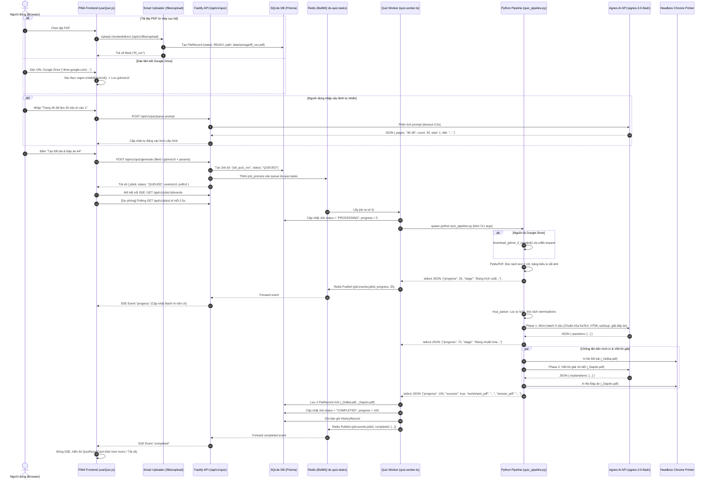

# Sơ Đồ & Luồng Dữ Liệu Hiện Tại: Module Tạo Bài Tập Trắc Nghiệm (Data Flow)

> **Mã công việc**: `TASK-00 — Audit Existing Module`  
> **Tài liệu tham chiếu**: `tasks/00_README.md`, `tasks/02_TASK-00-AUDIT.md`, `docs/current-module-audit.md`  
> **Mục tiêu**: Trực quan hóa toàn bộ luồng di chuyển của dữ liệu từ thao tác người dùng trên trình duyệt (Upload/Google Drive), qua hàng đợi Fastify/BullMQ, xuống lõi Python Engine, tương tác với Agnes AI, biên dịch qua Chrome Headless, và xuất bản ra 2 file PDF chuẩn in ấn.

---

## 1. Sơ Đồ Luồng Tổng Thể (End-to-End Data Flow Diagram)



---

## 2. Dữ Liệu Trung Gian Qua Từng Trạm (Intermediate Data Contracts)

### Trạm 1: Payload Gửi Yêu Cầu Tạo Job (`POST /api/v1/quiz/generate`)
```json
{
  "fileId": "fil_mutj28q9_90ef147c",
  "gdriveUrl": "",
  "pages": "36-38",
  "count": 30,
  "startNum": 1,
  "title": "BÀI TẬP TRẮC NGHIỆM HÓA HỌC 12",
  "subtitle": "Chuyên đề Ester - Lipid",
  "prefix": "HoaHoc12_Chuong1",
  "apiKey": ""
}
```

### Trạm 2: Dữ Liệu Đẩy Vào Hàng Đợi BullMQ (`QuizJobPayload`)
```typescript
interface QuizJobPayload {
  jobId: string;           // "job_quiz_mutj30la_8df1"
  fileId?: string;         // "fil_mutj28q9_90ef147c"
  gdriveUrl?: string;      // URL Google Drive (nếu có)
  pages: string;           // "36-38"
  count: number;           // 30
  startNum: number;        // 1
  title: string;           // Tiêu đề in
  subtitle?: string;       // Phụ đề in
  prefix: string;          // Tiền tố đặt tên file kết quả
  apiKey?: string;         // Agnes AI API Key tùy chọn của user
}
```

### Trạm 3: Dữ Liệu Khối Bóc Tách Định Thức Từ PDF (`mcq_parser.py`)
```json
{
  "source_number": 7,
  "stem": "Chất nào sau đây thuộc loại acid béo omega-3?",
  "clean_stem": "Chất nào sau đây thuộc loại acid béo omega-3?",
  "options": {
    "A": "[IMAGE_REF: fig_p37_1.png]",
    "B": "[IMAGE_REF: fig_p37_2.png]",
    "C": "[IMAGE_REF: fig_p37_3.png]",
    "D": "[IMAGE_REF: fig_p37_4.png]"
  },
  "confidence": "high",
  "raw": "Câu 7: Chất nào sau đây thuộc loại acid béo omega-3?\nA. ...\nB. ...\nC. ...\nD. ..."
}
```

### Trạm 4: Dữ Liệu Gửi Lên Agnes AI (Batch 5 Câu - Phase 1)
```json
{
  "questions": [
    {
      "number": 1,
      "question": "Chất béo là triester của alcohol nào sau đây với acid béo?",
      "options": {
        "A": "Methanol.",
        "B": "Glycerol.",
        "C": "Ethanol.",
        "D": "Ethylene glycol."
      }
    }
  ]
}
```

### Trạm 5: Dữ Liệu Agnes AI Trả Về (Phase 1 Standardization & Solution)
```json
{
  "questions": [
    {
      "number": 1,
      "question": "Chất béo là triester của alcohol nào sau đây với acid béo?",
      "options": {
        "A": "Methanol.",
        "B": "Glycerol.",
        "C": "Ethanol.",
        "D": "Ethylene glycol."
      },
      "answer": "B",
      "image_ref": null
    }
  ]
}
```

### Trạm 6: Dữ Liệu Agnes AI Trả Về (Phase 2 Explanations)
```json
{
  "explanations": {
    "1": "Chất béo là triester của glycerol với các acid béo, có công thức chung là (RCOO)<sub>3</sub>C<sub>3</sub>H<sub>5</sub>. Do đó chọn B."
  }
}
```

### Trạm 7: Dòng Tiến Trình Python Bắn Ra stdout (Stream Protocol)
```json
{"progress": 45, "stage": "Đang chuẩn hóa câu hỏi đa định dạng GDPT 2018 (30 câu)..."}
{"progress": 72, "stage": "Đang khởi tạo tiến trình in ấn và tạo lời giải chi tiết..."}
{"progress": 82, "stage": "Đang xuất tệp PDF Đề bài và Đáp án qua Chrome (1s)..."}
{"progress": 100, "stage": "Hoàn tất tạo Đề bài và Đáp án chi tiết v2.0!"}
```

### Trạm 8: Kết Quả Cuối Cùng Trả Về Cho Client (Hoàn Tất Job)
```json
{
  "success": true,
  "data": {
    "jobId": "job_quiz_mutj30la_8df1",
    "percentage": 100,
    "worksheet": {
      "fileId": "fil_debai_98124",
      "fileName": "HoaHoc12_Chuong1_DeBai.pdf",
      "sizeBytes": 248920,
      "pages": 3,
      "downloadUrl": "/api/v1/files/download/fil_debai_98124",
      "viewUrl": "/api/v1/files/view/fil_debai_98124"
    },
    "answer": {
      "fileId": "fil_dapan_98125",
      "fileName": "HoaHoc12_Chuong1_DapAn.pdf",
      "sizeBytes": 312040,
      "pages": 3,
      "downloadUrl": "/api/v1/files/download/fil_dapan_98125",
      "viewUrl": "/api/v1/files/view/fil_dapan_98125"
    },
    "questionsCount": 30,
    "extractedImagesCount": 6,
    "questionTypes": {
      "mcq": 30,
      "true_false": 0,
      "short_answer": 0
    }
  }
}
```

---

## 3. Bản Đồ Xử Lý Lỗi & Điểm Nghẽn (Failure Modes & Recovery Boundaries)

```text
┌─────────────────────────────────┬─────────────────────────────────┬─────────────────────────────────┐
│ Tình huống lỗi                  │ Hành vi hiện tại của hệ thống   │ Đánh giá & Rủi ro               │
├─────────────────────────────────┼─────────────────────────────────┼─────────────────────────────────┤
│ 1. Link Google Drive > 100MB    │ `urllib` ném HTTP 403 / lỗi HTML │ Gãy job ngay từ bước 1; không   │
│    hoặc yêu cầu xác nhận virus  │ trang quét virus của Google     │ có cơ chế bypass cookie/token   │
├─────────────────────────────────┼─────────────────────────────────┼─────────────────────────────────┤
│ 2. Tệp PDF scan thuần ảnh       │ Kiểm tra len(text) < 50 và ném  │ Từ chối phục vụ ngay lập tức;   │
│                                 │ lỗi ValueError không văn bản    │ chưa có fallback Vision/OCR     │
├─────────────────────────────────┼─────────────────────────────────┼─────────────────────────────────┤
│ 3. Agnes AI bị Rate Limit (429) │ Retry tối đa 3 lần với backoff  │ Tốt, nhưng nếu chết cả 3 lần    │
│    hoặc mạng rớt (Timeout)      │ (ngủ 2s, 4s, 6s)                │ sẽ làm chết cả job thay vì cứu  │
├─────────────────────────────────┼─────────────────────────────────┼─────────────────────────────────┤
│ 4. AI trả về JSON bị cắt cụt    │ Gọi hàm `_salvage_truncated_json`│ Cứu được một số cú pháp cụt,    │
│    do hết token                 │ và retry với temperature: 0.0   │ nhưng thiếu schema validation   │
├─────────────────────────────────┼─────────────────────────────────┼─────────────────────────────────┤
│ 5. Kết nối SSE trình duyệt bị   │ Client tự động kích hoạt bộ     │ Rất tốt; đảm bảo UI trên mobile │
│    ngắt giữa chừng (mạng yếu)   │ Polling timer mỗi 2.5 giây      │ không bị treo vô tận            │
└─────────────────────────────────┴─────────────────────────────────┴─────────────────────────────────┘
```
