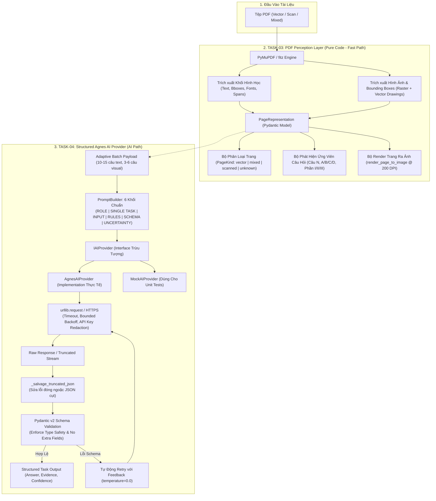

# Kế Hoạch Triển Khai: PLAN 2 — PDF PERCEPTION LAYER & AGNES PROVIDER

> **Nhiệm vụ kết hợp**: `TASK-03 — PDF Perception Layer` + `TASK-04 — Agnes Provider & Structured Prompt Engine`  
> **Tài liệu tham chiếu**:  
> - `tasks/00_README.md`  
> - `tasks/17_GLOBAL-RULES.md`  
> - `tasks/05_TASK-03-PDF-PERCEPTION.md`  
> - `tasks/06_TASK-04-AGNES-PROVIDER.md`  
> - `docs/current-module-audit.md`  
> - `docs/current-data-flow.md`  
> - `docs/agent-handoff.md`  
>  
> **Mục tiêu cốt lõi**:  
> 1. Xây dựng **Tầng Nhận Thức PDF (PDF Perception Layer)** thuần code (Code-First) để trích xuất sạch sẽ văn bản, hình học, bounding box, siêu dữ liệu trang, phân loại scan/vector/mixed và render trang sang ảnh cho các tác vụ thị giác khi cần.  
> 2. Xây dựng **Agnes Provider Đa Phương Thức & Prompt Engine Có Cấu Trúc (Structured Output)** đóng gói thành Provider trừu tượng có thể thay thế, kèm Pydantic schema validation, cơ chế retry, timeout, mock provider, bảo mật API key và thiết kế tối ưu cho **Batch Processing nhiều câu**.  
>  
> **Ranh giới nghiêm ngặt (Out-of-Scope cho Plan 2)**:  
> - **KHÔNG** triển khai Question Reconstruction (thuộc TASK-06).  
> - **KHÔNG** triển khai Smart Recognition (thuộc TASK-05).  
> - **KHÔNG** triển khai Answer Solving / Giải đề (thuộc TASK-08).  
> - **KHÔNG** triển khai Renderer / PDF Compiler (thuộc TASK-09).  
> - **KHÔNG** redesign UI.

---

## 1. Kiến Trúc Tổng Thể: CODE-FIRST + STRUCTURED AGNES PROVIDER



---

## 2. Thiết Kế Chi Tiết TASK-03: PDF Perception Layer

### 2.1. Cấu Trúc Biểu Diễn Trang (Page Representation Interfaces)
Xây dựng module `engines/quiz/perception/models.py` bằng **Pydantic v2**:

```python
from enum import Enum
from pydantic import BaseModel, Field

class PageKind(str, Enum):
    VECTOR = "vector"       # Văn bản dạng số / font vector rõ ràng, ít hoặc không có ảnh nền
    MIXED = "mixed"         # Có văn bản số kèm sơ đồ, hình ảnh minh họa, bảng biểu
    SCANNED = "scanned"     # Trang ảnh scan thuần túy (ít text layer, tỷ lệ diện tích ảnh lớn)
    UNKNOWN = "unknown"

class TextSpan(BaseModel):
    text: str
    bbox: tuple[float, float, float, float]  # (x0, y0, x1, y1)
    font: str = ""
    size: float = 0.0
    flags: int = 0
    color: int = 0

class TextLine(BaseModel):
    bbox: tuple[float, float, float, float]
    spans: list[TextSpan] = Field(default_factory=list)
    text: str = ""

class TextBlock(BaseModel):
    block_index: int
    bbox: tuple[float, float, float, float]
    lines: list[TextLine] = Field(default_factory=list)
    text: str = ""

class ExtractedImage(BaseModel):
    image_id: str
    xref: int
    bbox: tuple[float, float, float, float]
    width: int
    height: int
    format: str = "png"
    storage_path: str = ""
    is_mask: bool = False

class QuestionCandidate(BaseModel):
    candidate_number: int
    marker_text: str                          # e.g. "Câu 1:", "Bài 1."
    bbox: tuple[float, float, float, float]
    y_pos: float                              # y0 coordinate để so sánh thứ tự dọc
    options_detected: list[str] = Field(default_factory=list) # e.g. ["A", "B", "C", "D"]

class PageRepresentation(BaseModel):
    page_index: int                           # 0-based index
    page_number: int                          # 1-based human page number
    width: float
    height: float
    raw_text: str = ""
    blocks: list[TextBlock] = Field(default_factory=list)
    images: list[ExtractedImage] = Field(default_factory=list)
    drawing_count: int = 0
    character_count: int = 0
    image_area_ratio: float = 0.0             # Tổng diện tích ảnh / (width * height)
    page_kind: PageKind = PageKind.UNKNOWN
    candidates: list[QuestionCandidate] = Field(default_factory=list)
    rendered_image_path: str = ""             # Đường dẫn tệp PNG render của trang (nếu đã render)
```

### 2.2. Nhận Diện & Phân Loại Trang (Scan / Vector / Mixed Detection)
Xây dựng thuật toán phân loại deterministic trong `engines/quiz/perception/classifier.py`:
- **Đo lường**:
  - `character_count`: Tổng số ký tự có nghĩa sau khi lọc bỏ khoảng trắng thừa `\s+`.
  - `image_area_ratio`: $\sum \frac{\text{width}_i \times \text{height}_i}{\text{page\_width} \times \text{page\_height}}$ cho các ảnh có kích thước lớn (> 100x100px).
- **Quy tắc phân loại**:
  - `SCANNED`: Nếu `character_count < 60` VÀ `image_area_ratio > 0.55` (hoặc có ảnh phủ $> 70\%$ diện tích trang).  
    *Lưu ý (Global Rule 21)*: **Không reject trang scan**. Gắn nhãn `PageKind.SCANNED` để báo hiệu kích hoạt đường dẫn Selective Vision/OCR ở các bước sau.
  - `VECTOR`: Nếu `character_count >= 100` VÀ `image_area_ratio < 0.15` VÀ `len(images) == 0`.
  - `MIXED`: Có văn bản đáng kể (`character_count >= 80`) và có kèm theo hình vẽ raster hoặc vector drawings.
  - `UNKNOWN`: Các trường hợp ngoại lệ khác.

### 2.3. Bộ Phát Hiện Ứng Viên Câu Hỏi Nhanh (Fast Candidate Detector)
Xây dựng trong `engines/quiz/perception/candidates.py`:
- **Heuristic Patterns**:
  - Câu hỏi: `r"^(?:Câu|Bài|Question)\s*(\d+)[\.\:\)]"`, `r"^\b(\d+)[\.\)]\s+"`
  - Nhãn đáp án: `r"\b([A-D])[\.\)]\s+"`
  - Tiêu đề phần thi: `r"^(?:PHẦN|Phần)\s*(?:[I|V|X]+|\d+)[:\s]"`, `r"^(?:Chuyên đề|BÀI TẬP)[:\s]"`
- **Tiện ích mở rộng dải trang (Page Range Expansion Utilities)**:
  - `get_page_question_bounds(page_rep: PageRepresentation) -> tuple[int | None, int | None]`: Trả về `(first_q, last_q)` có trên trang.
  - `detect_continuation_candidate(prev_page: PageRepresentation, curr_page: PageRepresentation) -> bool`:
    - Trả về `True` nếu câu hỏi cuối của `prev_page` chưa có đủ 4 lựa chọn A, B, C, D và đầu trang `curr_page` bắt đầu bằng các phương án tiếp nối (ví dụ C, D hoặc text thân câu hỏi).
  - `get_next_page_index(curr_idx: int, total_pages: int) -> int | None`.

### 2.4. Render Trang Sang Ảnh Phục Vụ Selective Vision
- Hàm `render_page_to_image(doc: fitz.Document, page_index: int, output_dir: str, dpi: int = 200) -> str`:
  - Dùng `page.get_pixmap(dpi=dpi)` để render trang ra file ảnh PNG chất lượng cao.
  - Chỉ render khi cần thiết (On-Demand / Selective), không tự động render hàng loạt cả quyển PDF để tiết kiệm I/O đĩa và CPU.

---

## 3. Thiết Kế Chi Tiết TASK-04: Agnes Provider & Structured Prompt Engine

### 3.1. Hợp Đồng Provider Trừu Tượng (Provider Abstraction Interface)
Xây dựng module `engines/quiz/provider/base.py`:

```python
from abc import ABC, abstractmethod
from typing import TypeVar, Generic, Any
from pydantic import BaseModel

T = TypeVar("T", bound=BaseModel)

class ProviderConfig(BaseModel):
    api_key: str = ""
    base_url: str = "https://apihub.agnes-ai.com/v1"
    model: str = "agnes-3.0-flash"
    timeout_seconds: int = 90
    max_tokens: int = 4096
    max_retries: int = 3
    temperature: float = 0.0

class IAIProvider(ABC):
    @abstractmethod
    def generate_structured(
        self,
        task_name: str,
        user_prompt: str,
        system_prompt: str,
        schema: type[T],
        image_bytes: bytes | None = None,
        image_mime: str = "image/png",
        temperature: float = 0.0
    ) -> T:
        """
        Gửi yêu cầu đến mô hình AI và cưỡng chế trả về đúng Pydantic model T.
        Tự động parse JSON, validate schema, retry khi lỗi và sanitize log.
        """
        pass
```

### 3.2. Cấu Trúc Prompt Engine 6 Khối Chuẩn (PromptBuilder)
Xây dựng module `engines/quiz/provider/prompt_builder.py`. Mọi prompt sinh ra bắt buộc phải bao gồm 6 khối phân định rõ ràng bằng markdown tags:

```text
# 1. ROLE
You are an expert Vietnamese examination data extractor and layout engineer.

# 2. SINGLE TASK
[Chỉ định duy nhất 1 nhiệm vụ, ví dụ: Phân rã khối văn bản thô thành danh sách câu hỏi trắc nghiệm đã bóc tách stem và options]

# 3. INPUT
[Dữ liệu JSON đầu vào sạch sẽ, không dư thừa thông tin]

# 4. RULES
- Never hallucinate questions not present in the input.
- Keep exact mathematical symbols and chemical formulas.
- Do NOT generate explanations or solve answers in this step.
- Preserve image tokens [IMAGE_REF: ...].

# 5. OUTPUT SCHEMA
Respond with a single JSON object strictly matching this schema:
{ ... }

# 6. UNCERTAINTY POLICY
- If a question is ambiguous or partially truncated, set "confidence": "low" and record "evidence": "...".
- Do not guess missing options.
```

> **Quy định quan trọng (Global Rule 12 & 14)**:
> - **KHÔNG** yêu cầu Chain-of-Thought ("Suy nghĩ từng bước...", "Let's think step by step").
> - Đầu ra có cấu trúc: `{ answer, evidence, confidence }`.
> - **KHÔNG** gọi AI cho từng câu đơn lẻ. Thiết kế nhận danh sách batch items.

### 3.3. Hiện Thực Hóa `AgnesAIProvider` (Production Implementation)
Xây dựng trong `engines/quiz/provider/agnes.py`:
- **Xử lý gọi mạng**: Dùng `urllib.request` với timeout rõ ràng.
- **Hỗ trợ Multimodal Vision**:
  - Nếu có `image_bytes`: Encode sang Base64 và gửi theo chuẩn OpenAI Vision:
    ```json
    { "type": "image_url", "image_url": { "url": "data:image/png;base64,..." } }
    ```
- **Cơ chế Bounded Retries**:
  - Retry tối đa `max_retries = 3` cho các mã lỗi: `429 (Rate Limit)`, `500`, `502`, `503`, `504` và `TimeoutError` với exponential backoff (`2s`, `4s`, `6s`).
  - Lỗi `401 Unauthorized` hoặc `400 Bad Request` ném lỗi ngay lập tức (fail-fast).
- **Cứu vãn & Validate JSON (JSON Salvage & Schema Validation)**:
  - Nếu phản hồi bị cắt cụt do chạm `max_tokens`: Chạy hàm `_salvage_truncated_json` để tự động đóng các thẻ ngoặc `]}` còn thiếu.
  - Chuyển JSON vào Pydantic model: `schema.model_validate(json_dict)`.
  - Nếu gặp `ValidationError`: Tự động gửi lại request kèm thông báo lỗi cụ thể để AI sửa chữa ở `temperature = 0.0`.

### 3.4. Hiện Thực Hóa `MockAIProvider` (Unit Testing Simulation)
Xây dựng trong `engines/quiz/provider/mock.py`:
- Cho phép giả lập phản hồi hợp lệ theo schema mà không cần kết nối internet hay tiêu tốn API quota.
- Cho phép mô phỏng có kiểm soát các tình huống lỗi:
  - `simulate_timeout = True` $\rightarrow$ Ném `TimeoutError`.
  - `simulate_http_500 = True` $\rightarrow$ Ném HTTP 500 error.
  - `simulate_malformed_json = True` $\rightarrow$ Trả về chuỗi `{"questions": [` (bị cụt).
  - `simulate_missing_fields = True` $\rightarrow$ Trả về JSON thiếu trường bắt buộc để kiểm thử validation.

### 3.5. Bảo Mật & Nhật Ký Ghi Lỗi (Security & Redacted Logging)
- **Tuyệt đối không log API Key**:
  ```python
  def redact_sensitive_info(message: str, api_key: str) -> str:
      if api_key and len(api_key) > 6:
          message = message.replace(api_key, "[REDACTED_API_KEY]")
      return re.sub(r"(?:Bearer|sk-|key-)[a-zA-Z0-9_\-]{16,}", "[REDACTED_SECRET]", message)
  ```
- Mọi exception log và console stdout/stderr đều phải chạy qua hàm sanitize này trước khi in hoặc phát lên hệ thống.

---

## 4. Kế Hoạch Tổ Chức Tệp Mã Nguồn (File Organization)

```text
engines/quiz/
├── perception/                      # [TASK-03] PDF Perception Layer
│   ├── __init__.py
│   ├── models.py                    # Pydantic models: PageRepresentation, TextBlock, PageKind...
│   ├── extractor.py                 # PyMuPDF extractor (text, geometry, images, drawings)
│   ├── classifier.py                # Phân loại scan/vector/mixed
│   └── candidates.py                # Heuristic candidate detector & page range bounds
│
├── provider/                        # [TASK-04] Agnes Provider & Prompt Engine
│   ├── __init__.py
│   ├── base.py                      # IAIProvider interface & ProviderConfig
│   ├── prompt_builder.py            # 6-block structured prompt builder
│   ├── validation.py                # JSON salvage & Pydantic schema validation
│   ├── agnes.py                     # AgnesAIProvider implementation (Vision, Retries, Timeout)
│   └── mock.py                      # MockAIProvider for deterministic unit testing
│
└── tests/                           # Unit Test Suite Cho PLAN 2
    ├── __init__.py
    ├── test_perception.py           # Tests cho TASK-03 (Bboxes, Scan/Vector, Candidates)
    └── test_agnes_provider.py       # Tests cho TASK-04 (Mock, Retries, Validation, Timeout)
```

---

## 5. Chiến Lược Kiểm Thử (Test Strategy)

### 5.1. Kiểm thử Tầng Nhận Thức PDF (TASK-03 Tests: `test_perception.py`)
1. **Test Extract Vector PDF**:
   - Sử dụng một tệp PDF mẫu (hoặc tạo programmatic PDF bằng PyMuPDF):
   - Trích xuất trang, xác minh `PageRepresentation` có đầy đủ `width`, `height`, `character_count > 0`, `blocks` có tọa độ chuẩn.
2. **Test Scan vs Vector Classification**:
   - Trang chỉ chứa text $\rightarrow$ phân loại `PageKind.VECTOR`.
   - Trang chỉ chứa ảnh chiếm $> 70\%$ diện tích $\rightarrow$ phân loại `PageKind.SCANNED`, không bị lỗi crash.
   - Trang có cả text và ảnh minh họa $\rightarrow$ phân loại `PageKind.MIXED`.
3. **Test Fast Candidate Detection**:
   - Đưa đoạn văn bản có `Câu 1:`, `Câu 2:`, `A.`, `B.`, `C.`, `D.` $\rightarrow$ nhận diện đúng 2 candidates và vị trí y tương ứng.
4. **Test Render Page To Image**:
   - Gọi `render_page_to_image()` $\rightarrow$ sinh ra tệp ảnh PNG hợp lệ trên đĩa, verify kích thước pixel tương ứng với DPI 200.

### 5.2. Kiểm thử Tầng Agnes Provider (TASK-04 Tests: `test_agnes_provider.py`)
Sử dụng `MockAIProvider` để kiểm thử 100% các tình huống biên không cần mạng:
1. **Test Happy Path**: Provider trả về JSON chuẩn $\rightarrow$ validate thành công ra Pydantic object.
2. **Test Malformed JSON Recovery**: Provider trả về chuỗi JSON cụt $\rightarrow$ hàm `_salvage_truncated_json` sửa thành công và validate được.
3. **Test Missing Fields & Schema Failure**: Provider trả về thiếu trường bắt buộc $\rightarrow$ bắt đúng `ValidationError`.
4. **Test Retry on HTTP 500 / 429**: Mô phỏng lỗi 500 ở 2 lần đầu, thành công ở lần 3 $\rightarrow$ Provider retry thành công và trả về kết quả.
5. **Test Fail-Fast on HTTP 401**: Mô phỏng lỗi 401 $\rightarrow$ Ném lỗi ngay lập tức, không retry lãng phí thời gian.
6. **Test API Key Redaction**: Kiểm tra chuỗi thông báo lỗi khi có API key $\rightarrow$ đảm bảo key bị che thành `[REDACTED_API_KEY]`.

---

## 6. Tiêu Chí Nghiệm Thu (Acceptance Criteria)

### TASK-03 (PDF Perception)
- [ ] Trích xuất đầy đủ siêu dữ liệu mức trang (`width`, `height`, `raw_text`, `blocks`, `bboxes`, `images`, `character_count`, `image_area_ratio`) thành đối tượng `PageRepresentation`.
- [ ] Phân loại chính xác các trang thành `vector`, `mixed`, `scanned`. Trang scan **không bị ném lỗi reject** mà được đánh dấu cờ rõ ràng.
- [ ] Nhận diện nhanh các ứng viên câu hỏi (`Câu N`, `A/B/C/D`, `Phần I/II/III`) kèm tọa độ trục y.
- [ ] Hàm `render_page_to_image` render thành công trang PDF ra file ảnh PNG chất lượng cao.

### TASK-04 (Agnes Provider)
- [ ] Interface `IAIProvider` hoàn toàn độc lập, tách rời tầng logic nghiệp vụ khỏi chi tiết gọi API.
- [ ] `AgnesAIProvider` hỗ trợ cả văn bản thuần và ảnh Vision Base64, có cơ chế retry bounded (tối đa 3 lần) và timeout an toàn.
- [ ] Mọi prompt đều được sinh ra từ `PromptBuilder` với 6 khối chuẩn: `ROLE`, `SINGLE TASK`, `INPUT`, `RULES`, `OUTPUT SCHEMA`, `UNCERTAINTY`.
- [ ] Tuyệt đối không log hoặc để lộ API key trong logs hoặc thông báo lỗi.
- [ ] `MockAIProvider` vượt qua 100% các bài kiểm thử giả lập lỗi mạng, timeout, và malformed JSON.
- [ ] Thiết kế payload sẵn sàng cho **Batch Processing nhiều câu**, không ép gọi từng câu đơn lẻ.

---

## 7. Trạng Thái & Điểm Dừng (Checkpoint)
- Sau khi lưu bản kế hoạch này vào `docs/implementation-plan-02.md`, **tiến trình sẽ dừng lại ngay lập tức**.
- **Không thực hiện code** cho đến khi kế hoạch được người dùng xem xét và phê duyệt.
