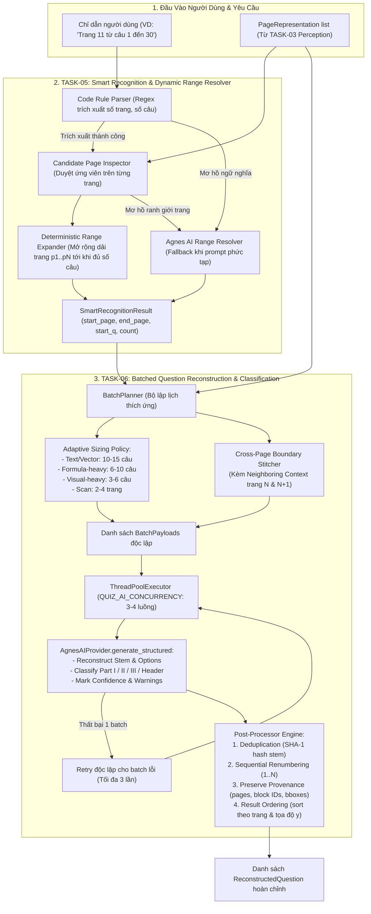

# Kế Hoạch Triển Khai: PLAN 3 — SMART RECOGNITION & BATCHED QUESTION RECONSTRUCTION

> **Nhiệm vụ kết hợp**: `TASK-05 — Smart Recognition & Range Resolver` + `TASK-06 — Batched Reconstruction & Classification`  
> **Tài liệu tham chiếu**:  
> - `tasks/00_README.md`  
> - `tasks/17_GLOBAL-RULES.md`  
> - `tasks/07_TASK-05-SMART-RECOGNITION-RANGE.md`  
> - `tasks/08_TASK-06-BATCHED-RECONSTRUCTION-CLASSIFICATION.md`  
> - `docs/implementation-plan-02.md`  
> - `docs/agent-handoff.md`  
>  
> **Mục tiêu cốt lõi**:  
> 1. Xây dựng **Tầng Nhận Diện Thông Minh & Phân Giải Dải Trang Động (Smart Recognition & Dynamic Range Resolver)**: Khai thác Fast Path bằng code thuần để phân tích yêu cầu người dùng, kiểm tra ứng viên câu hỏi trên các trang PDF, và tự động mở rộng dải trang cho đến khi đủ số lượng câu yêu cầu. Chỉ gọi Agnes khi gặp mơ hồ ngữ nghĩa hoặc bố cục.  
> 2. Xây dựng **Bộ Lập Lịch Batch Thích Ứng & Tái Cấu Trúc Câu Hỏi Theo Lô (Adaptive Batching & Question Reconstruction)**: Gom nhóm câu hỏi theo mật độ (văn bản: 10–15 câu, công thức: 6–10 câu, hình ảnh: 3–6 câu, scan: 2–4 trang). Giải quyết triệt để trường hợp **câu hỏi bị ngắt ngang qua 2 trang (Page N $\rightarrow$ Page N+1)** bằng ngữ cảnh trang lân cận (Neighboring Context), phân loại phần thi (Phần I, II, III), khử trùng lặp và hỗ trợ thực thi song song có kiểm soát lỗi theo từng batch.  
>  
> **Ranh giới nghiêm ngặt (Out-of-Scope cho Plan 3)**:  
> - **KHÔNG** làm Answer Solving / Giải đề và sinh lời giải (thuộc TASK-08).  
> - **KHÔNG** làm HTML/CSS Rendering và PDF Compiling (thuộc TASK-09).  
> - **KHÔNG** thay đổi giao diện UI Frontend (UI Contract đã đóng băng).

---

## 1. Kiến Trúc Tổng Thể: FAST PATH CODE-FIRST + BATCHED AGNES AI



---

## 2. Thiết Kế Chi Tiết TASK-05: Smart Recognition & Range Resolver

### 2.1. Fast Path Code Parser (`rule_parser.py`)
Phân tích cú pháp trực tiếp bằng biểu thức chính quy (Regex) và logic tiền xử lý số học, tuyệt đối không gọi AI nếu câu lệnh rõ ràng:
- **Các mẫu câu phổ biến**:
  - `Trang (\d+)\s*(?:đến|-)\s*(\d+)`: Trích xuất `start_page`, `end_page`.
  - `(?:từ\s*)?[Cc]âu\s*(\d+)\s*(?:đến|-)\s*(\d+)`: Trích xuất `start_question`, `end_question` $\rightarrow$ `count = end_q - start_q + 1`.
  - `(?:lấy|chọn|làm)\s*(\d+)\s*câu`: Trích xuất `question_count`.
  - `(?:bắt đầu từ|từ)\s*[Cc]âu\s*(\d+)`: Trích xuất `start_question`.
  - `[Đđ]ề\s*(\d+)`: Nhận diện mã đề / đề thi.

### 2.2. Bộ Duyệt & Mở Rộng Dải Trang Tự Động (`range_resolver.py`)
- **Thuật toán mở rộng dải trang (Dynamic Range Expansion)**:
  1. Nếu người dùng chỉ định `start_page` (ví dụ: Trang 11) và `question_count` (ví dụ: 30 câu, bắt đầu từ Câu 1):
  2. Bắt đầu từ trang `curr_page = start_page`.
  3. Đọc danh sách `candidates` từ `PageRepresentation` của `curr_page`.
  4. Đếm số câu hỏi hợp lệ tìm thấy trên `curr_page` nằm trong dải cần lấy.
  5. Nếu tổng số câu tích lũy chưa đạt `question_count`:
     - Kiểm tra `detect_continuation_candidate(curr_page, curr_page + 1)` để biết câu cuối trang có bị tràn sang trang tiếp theo hay không.
     - Tăng `curr_page += 1`, tiếp tục cộng dồn số câu.
  6. Dừng lại khi:
     - Số lượng câu hỏi tích lũy $\ge \text{question\_count}$;
     - Hoặc gặp câu hỏi có số thứ tự $\ge \text{start\_question} + \text{question\_count}$;
     - Hoặc chạm giới hạn an toàn (`max_page_traversal = 50` trang hoặc hết tài liệu) để ngăn chặn vòng lặp vô tận (runaway traversal).
  7. Thiết lập `end_page = curr_page`.

### 2.3. Ngưỡng Gọi AI & Fallback An Toàn (AI Path)
**Chỉ kích hoạt `AgnesAIProvider` khi**:
1. `rule_parser` không khớp được cấu trúc số học nào từ chuỗi nhập của người dùng (ngữ nghĩa phức tạp, e.g. *"Lấy phần bài tập este ở giữa sách tầm 20 câu"*).
2. Phát hiện bất đồng bộ lớn giữa dải số do người dùng yêu cầu và số thứ tự câu hỏi thực tế trên trang (e.g. người dùng yêu cầu câu 1-20 nhưng trang 11 lại bắt đầu từ câu 45).
3. Ranh giới câu hỏi bị mâu thuẫn do trang scan hoặc layout phức tạp.

- **Mô hình Dữ Liệu Đầu Ra của TASK-05 (`SmartRecognitionResult`)**:
```python
class SmartRecognitionResult(BaseModel):
    start_page: int
    end_page: int
    start_question: int = 1
    question_count: int
    question_mode: str = "auto"       # "auto" | "explicit" | "ai_resolved"
    confidence: float = 1.0           # 1.0 nếu Fast Path, 0.85-0.95 nếu AI
    warnings: list[str] = Field(default_factory=list)
```

---

## 3. Thiết Kế Chi Tiết TASK-06: Batched Question Reconstruction & Classification

### 3.1. Bộ Lập Lịch Batch Thích Ứng (`BatchPlanner`)
Global Rule 14 nghiêm cấm gọi AI cho từng câu đơn lẻ. `BatchPlanner` tính toán kích thước lô dựa trên đặc điểm nội dung của trang:

| Loại Nội Dung Trang | Kích Thước Batch | Tiêu Chí Nhận Diện |
| :--- | :--- | :--- |
| **Text / Vector Chuẩn** | **10 – 15 câu** | Trang `PageKind.VECTOR`, ít ký tự toán học (`< 5` dấu `$`), không có hình vẽ lớn. |
| **Công Thức Nặng (Formula-Heavy)** | **6 – 10 câu** | Chứa nhiều ký hiệu LaTeX, công thức hóa học, phân số, ma trận. |
| **Hình Ảnh / Bảng Biểu (Visual-Heavy)** | **3 – 6 câu** | Chứa sơ đồ thí nghiệm, đồ thị hàm số, bảng số liệu, nhiều khối vẽ vector. |
| **Tài Liệu Scan (Scanned Documents)** | **2 – 4 trang** | Trang `PageKind.SCANNED`, cần kèm ảnh crop hoặc rendered page image. |

### 3.2. Xử Lý Ranh Giới Câu Hỏi Ngắt Trang (Cross-Page Split Questions: Page N $\rightarrow$ Page N+1)
Trường hợp câu hỏi bắt đầu ở cuối trang $N$ (ví dụ: nội dung đề và phương án A, B) và tràn sang đầu trang $N+1$ (phương án C, D hoặc đoạn văn tiếp nối):
1. **Phát hiện**: Dùng hàm `detect_continuation_candidate(page_N, page_N_plus_1)` từ TASK-03.
2. **Chiến lược gom batch**:
   - `BatchPlanner` ưu tiên **không cắt đôi một câu hỏi sang 2 batch khác nhau**. Nếu một câu hỏi bị tràn trang, toàn bộ các khối văn bản liên quan ở cả trang $N$ và $N+1$ sẽ được gom chung vào cùng một batch.
3. **Cơ chế Tiêm Ngữ Cảnh Lân Cận (Neighboring Context Injection)**:
   - Trong mỗi `BatchPayload`, bổ sung 2 trường ngữ cảnh biên:
     - `neighboring_prev_context`: Đoạn văn bản cuối cùng của trang trước đó (khoảng 200 ký tự) để AI đối chiếu nếu đầu trang hiện tại có văn bản mồ côi.
     - `neighboring_next_context`: Đoạn văn bản đầu tiên của trang kế tiếp để AI đối chiếu nếu cuối batch có câu chưa đóng đủ phương án.
4. **Chỉ thị Prompt**: Yêu cầu AI nối liền phần stem bị đứt quãng và ghép đúng các lựa chọn A, B, C, D của cùng một câu hỏi.

### 3.3. Phân Loại Phần Thi (Section Classification: Part I / II / III)
Chuẩn hóa theo định dạng đề thi tốt nghiệp THPT mới của Bộ GD&ĐT:
- **`PART_I_MCQ` (Phần I - Trắc nghiệm nhiều lựa chọn)**:
  - 4 phương án cố định A, B, C, D. Thí sinh chọn 1 phương án đúng.
- **`PART_II_TF` (Phần II - Trắc nghiệm Đúng / Sai)**:
  - Thường gồm một đoạn văn cảnh / mệnh đề gốc và 4 ý a), b), c), d). Thí sinh chọn Đúng (True) hoặc Sai (False) cho từng ý.
- **`PART_III_SHORT` (Phần III - Trắc nghiệm Trả lời ngắn)**:
  - Câu hỏi tự luận ngắn điền kết quả (số thực, số nguyên, phân số hoặc từ khóa), không có phương án trắc nghiệm A/B/C/D.
- **`SECTION_HEADER` (Tiêu đề / Lời dẫn bài thi)**:
  - Bỏ qua, không chuyển thành bản ghi câu hỏi, nhưng lưu vào danh sách phân đoạn nếu cần.

### 3.4. Mô Hình Dữ Liệu Câu Hỏi Tái Cấu Trúc (`ReconstructedQuestion`)
```python
from enum import Enum
from pydantic import BaseModel, Field

class QuestionType(str, Enum):
    PART_I_MCQ = "part_i_mcq"       # Trắc nghiệm 4 lựa chọn A/B/C/D
    PART_II_TF = "part_ii_tf"       # Trắc nghiệm Đúng/Sai 4 ý a/b/c/d
    PART_III_SHORT = "part_iii_short" # Trắc nghiệm trả lời ngắn (điền số)
    SECTION_HEADER = "section_header" # Tiêu đề/chỉ dẫn (loại trừ)

class QuestionOption(BaseModel):
    label: str                      # "A", "B", "C", "D"
    text: str                       # Nội dung phương án (giữ nguyên KaTeX)
    is_correct: bool | None = None  # None ở bước này (giải đề ở TASK-08)

class TFSubStatement(BaseModel):
    label: str                      # "a", "b", "c", "d"
    statement: str                  # Nội dung mệnh đề
    is_correct: bool | None = None  # None ở bước này

class ReconstructedQuestion(BaseModel):
    id: str                         # ID duy nhất e.g. "q_p11_c1_a8f9"
    number: int                     # Số thứ tự tuần tự trong đề (1..N)
    source_number: int              # Số thứ tự gốc ghi trên đề (e.g. 1, 10, 45)
    type: QuestionType              # Phân loại phần thi
    stem: str                       # Nội dung câu hỏi (chứa [IMAGE_REF: ...] nếu có)
    options: list[QuestionOption] = Field(default_factory=list)
    sub_statements: list[TFSubStatement] = Field(default_factory=list)
    source_pages: list[int]         # Danh sách trang gốc (e.g. [11] hoặc [11, 12])
    source_block_ids: list[int] = Field(default_factory=list)
    bboxes: list[tuple[float, float, float, float]] = Field(default_factory=list)
    confidence: float = 1.0
    warnings: list[str] = Field(default_factory=list)
```

### 3.5. Thực Thi Song Song & Retry Độc Lập Theo Từng Batch
- **Thực thi song song (Parallel Execution)**:
  - Sử dụng `ThreadPoolExecutor` với số luồng cấu hình từ `QUIZ_AI_CONCURRENCY` (mặc định 3–4 luồng).
  - Các batch không phụ thuộc lẫn nhau được phân phối độc lập qua `IAIProvider.generate_structured`.
- **Cơ chế Bounded Retry Độc Lập cho Từng Batch (Per-Batch Isolated Retry)**:
  - Nếu Batch 2 bị timeout hoặc lỗi schema: **CHỈ retry lại duy nhất Batch 2** (tối đa 3 lần). Tuyệt đối không hủy bỏ hay chạy lại Batch 1 và Batch 3 đã hoàn thành thành công.
- **Suy thoái có kiểm soát (Graceful Degradation Fallback)**:
  - Nếu một batch thất bại sau cả 3 lần retry: Bộ xử lý tự động kích hoạt fallback cục bộ từ các khối văn bản thuần của `PageRepresentation` để ghép câu hỏi thô, đánh dấu `confidence = 0.5` kèm warning rõ ràng, thay vì làm chết toàn bộ tiến trình của cả job.

### 3.6. Xử Lý Sau Batch (Post-Processing Engine)
1. **Khử trùng lặp (Deduplication)**:
   - Tính mã băm SHA-1 cho `stem` đã chuẩn hóa (lọc bỏ khoảng trắng thừa và thẻ định dạng).
   - Loại bỏ các câu hỏi bị trùng lặp do quét đè ranh giới giữa 2 batch.
2. **Đánh số tuần tự (Sequential Renumbering)**:
   - Cưỡng chế đánh số thứ tự câu hỏi `number` tăng dần từ `start_question` đến `start_question + N - 1` độc lập với số do AI trả về.
   - Bảo toàn số gốc trong trường `source_number`.
3. **Bảo toàn nguồn gốc (Provenance Preservation)**:
   - Giữ lại `source_pages`, `source_block_ids`, và tọa độ `bboxes` để phục vụ khâu Visual QA và gắn nhãn ảnh.
4. **Sắp xếp kết quả chuẩn mực (Stable Ordering)**:
   - Sắp xếp các câu hỏi theo thứ tự đọc tự nhiên: `(min(source_pages), y_pos)`.

---

## 4. Kế Hoạch Tổ Chức Tệp Mã Nguồn (File Organization)

```text
engines/quiz/
├── perception/                         # [TASK-03] Đã hoàn thành & test 100%
│   ├── models.py
│   ├── classifier.py
│   ├── candidates.py
│   ├── renderer.py
│   └── extractor.py
│
├── provider/                           # [TASK-04] Đã hoàn thành & test 100%
│   ├── base.py
│   ├── prompt_builder.py
│   ├── validation.py
│   ├── mock.py
│   └── agnes.py
│
├── recognition/                        # [TASK-05 MỚI] Smart Recognition & Range Resolver
│   ├── __init__.py
│   ├── models.py                       # SmartRecognitionResult, RangeConstraint
│   ├── rule_parser.py                  # Code regex parser cho câu lệnh người dùng
│   └── range_resolver.py               # Deterministic candidate traverser & AI fallback
│
├── reconstruction/                     # [TASK-06 MỚI] Batched Reconstruction & Classification
│   ├── __init__.py
│   ├── models.py                       # ReconstructedQuestion, BatchPayload, QuestionType...
│   ├── batch_planner.py                # Adaptive BatchPlanner (vector/formula/visual/scan sizes)
│   ├── reconstructor.py                # Multi-threaded batch runner, isolated retry, fallback
│   └── post_processor.py               # Dedup, renumbering, provenance, ordering
│
└── tests/                              # Bộ kiểm thử tự động
    ├── test_perception.py              # Đã pass (7 tests)
    ├── test_agnes_provider.py          # Đã pass (12 tests)
    ├── test_smart_recognition.py       # [MỚI] Tests cho TASK-05 (Rule parse, Range expansion)
    └── test_reconstruction.py          # [MỚI] Tests cho TASK-06 (BatchPlanner, Split question, Dedup)
```

---

## 5. Chiến Lược Kiểm Thử (Test Strategy)

### 5.1. Kiểm Thử Smart Recognition & Range Resolver (`test_smart_recognition.py`)
1. **Test Rule Parser**:
   - Nhận diện đúng các định dạng: `"Trang 11 từ câu 1 đến 30"`, `"Trang 36-38 lấy 25 câu bắt đầu từ câu 1"`, `"Lấy 10 câu từ câu 5 trang 2"`.
   - Bắt các trường hợp lỗi hoặc trả về `None` khi câu lệnh không hợp lệ để kích hoạt AI.
2. **Test Deterministic Range Expansion**:
   - Giả lập tài liệu có 5 trang: Trang 1 (Câu 1–10), Trang 2 (Câu 11–20), Trang 3 (Câu 21–30), Trang 4 (Câu 31–40).
   - Yêu cầu: Bắt đầu từ trang 1, lấy 25 câu.
   - Kết quả: Tự động mở rộng dải trang ra đúng `start_page: 1`, `end_page: 3`. Không bị duyệt lố sang trang 4 hoặc 5.
3. **Test Hard Traversal Safety Limit**:
   - Mô phỏng tài liệu không tìm thấy đủ số câu $\rightarrow$ dừng lại an toàn tại `max_page_traversal` và trả về cảnh báo `warning`, không treo vòng lặp vô tận.
4. **Test AI Fallback**:
   - Khi đưa câu lệnh tự nhiên phức tạp không parse được bằng regex $\rightarrow$ gọi qua `MockAIProvider` trả về kết quả hợp lệ với `confidence < 1.0`.

### 5.2. Kiểm Thử Batched Question Reconstruction (`test_reconstruction.py`)
1. **Test Adaptive Batch Sizing**:
   - Kiểm tra `BatchPlanner` tính đúng kích thước:
     - Dữ liệu text thường: 10–15 câu/batch.
     - Dữ liệu nhiều công thức: 6–10 câu/batch.
     - Dữ liệu nhiều hình vẽ/ảnh: 3–6 câu/batch.
     - Trang scan: 2–4 trang/batch.
2. **Test Cross-Page Split Question**:
   - Tạo dữ liệu kiểm thử với Trang 1 có Câu 5 kết thúc bằng lựa chọn B, Trang 2 bắt đầu bằng lựa chọn C, D.
   - Verify `BatchPlanner` truyền đúng `neighboring_context` và tái cấu trúc thành đúng 1 câu hỏi duy nhất có đủ A, B, C, D với `source_pages = [1, 2]`.
3. **Test Section Classification**:
   - Kiểm thử nhận diện chính xác `PART_I_MCQ` (4 lựa chọn), `PART_II_TF` (Đúng/Sai 4 ý a/b/c/d), `PART_III_SHORT` (Trả lời ngắn).
   - Loại trừ thành công các dòng `SECTION_HEADER`.
4. **Test Parallel Execution & Isolated Batch Retry**:
   - Chạy 3 batches đồng thời qua `MockAIProvider`.
   - Giả lập Batch 2 bị lỗi ở lần 1 và thành công ở lần 2 $\rightarrow$ kiểm chứng chỉ có Batch 2 bị gọi lại, Batch 1 và 3 hoàn tất bình thường.
5. **Test Deduplication & Sequential Renumbering**:
   - Đưa vào 2 câu hỏi bị trùng nội dung stem $\rightarrow$ giữ lại đúng 1 câu.
   - Cưỡng chế đánh số thứ tự tăng dần 1, 2, 3... liên tục.

---

## 6. Tiêu Chí Nghiệm Thu (Acceptance Criteria)

### TASK-05 (Smart Recognition & Dynamic Range Resolver)
- [ ] Parse thành công bằng code các lệnh người dùng dạng số học phổ biến mà **không tốn bất kỳ lượt gọi AI nào**.
- [ ] Tự động duyệt ứng viên và mở rộng dải trang từ `start_page` tới `end_page` chính xác, dừng lại ngay khi thỏa mãn số lượng câu.
- [ ] Xử lý an toàn với chặn trên `max_page_traversal` để tránh duyệt tràn trang.
- [ ] Chỉ gọi Agnes khi gặp chỉ dẫn tự nhiên mơ hồ, có `warnings` giải thích rõ ràng.

### TASK-06 (Batched Reconstruction & Classification)
- [ ] `BatchPlanner` phân bổ batch thích ứng chính xác theo 4 loại nội dung (text, formula, visual, scan).
- [ ] Ghép nối chính xác các câu hỏi bị ngắt ngang qua 2 trang ($N \rightarrow N+1$) nhờ cơ chế Neighboring Context.
- [ ] Phân loại chuẩn xác 3 phần thi: Phần I (MCQ 4 lựa chọn), Phần II (Đúng/Sai 4 ý), Phần III (Trả lời ngắn).
- [ ] Không có câu hỏi nào bị trùng lặp (`deduplication` hoạt động ổn định).
- [ ] Không có câu hỏi nào bị mất mát trong dải đã yêu cầu.
- [ ] Đánh số thứ tự tuần tự tuyệt đối từ $1$ đến $N$.
- [ ] Cơ chế thực thi song song và retry độc lập theo từng batch hoạt động tin cậy.

---

## 7. Trạng Thái & Điểm Dừng (Checkpoint)
- Kế hoạch chi tiết này đã được lưu vào `docs/implementation-plan-03.md`.
- **Dừng lại ngay lập tức tại đây**. Không thực hiện bất kỳ thay đổi mã nguồn nào cho đến khi người dùng xem xét và phê duyệt kế hoạch.
