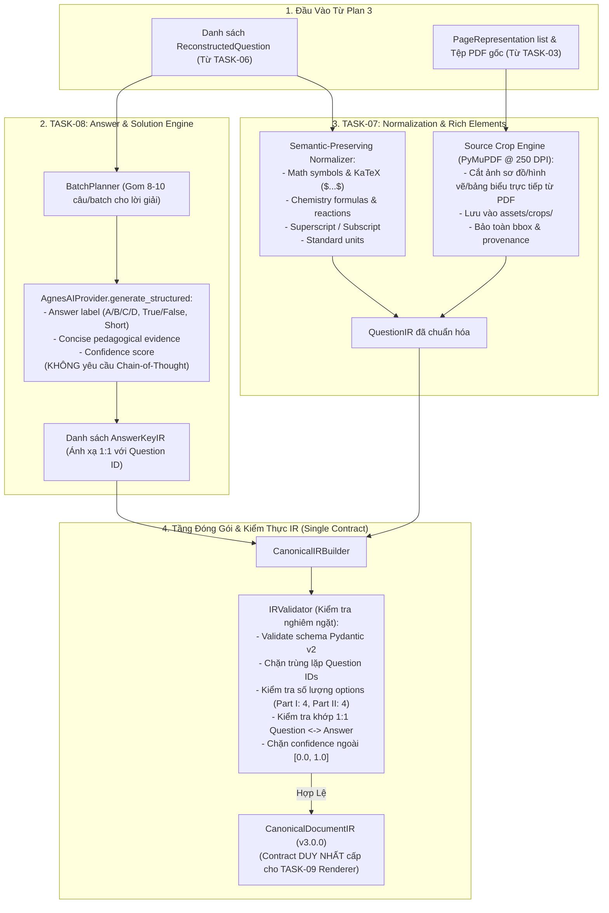

# Kế Hoạch Triển Khai: PLAN 4 — CANONICAL DOCUMENT IR, NORMALIZATION & ANSWER ENGINE

> **Nhiệm vụ kết hợp**: `TASK-07 — Canonical Document IR, Normalization & Rich Elements` + `TASK-08 — Answer & Solution Engine`  
> **Tài liệu tham chiếu**:  
> - `tasks/00_README.md`  
> - `tasks/17_GLOBAL-RULES.md`  
> - `tasks/09_TASK-07-IR-NORMALIZATION-RICH-ELEMENTS.md`  
> - `tasks/10_TASK-08-ANSWER-SOLUTION.md`  
> - `docs/implementation-plan-03.md`  
> - `docs/agent-handoff.md`  
>  
> **Mục tiêu cốt lõi**:  
> 1. Xây dựng **Canonical Document IR (Trung Gian Tài Liệu Chuẩn Hóa)**: Đóng vai trò là **hợp đồng kỹ thuật duy nhất (Single Contract)** giữa toàn bộ pipeline AI và tầng HTML/PDF Renderer. Tuyệt đối không để phản hồi AI thô đi thẳng xuống Renderer.  
> 2. Xây dựng **Bộ Chuẩn Hóa Nội Dung Bảo Toàn Ngữ Nghĩa (Semantic-Preserving Normalizer)**: Chuẩn hóa công thức toán KaTeX, chỉ số trên/dưới hóa học, phương trình phản ứng, và đơn vị đo lường mà không làm biến đổi nội dung gốc.  
> 3. Xây dựng **Trình Quản Lý & Trích Xuất Phần Tử Đồ Họa (Rich Element Manager)**: Ưu tiên tuyệt đối việc **cắt ảnh gốc độ phân giải cao từ PDF (Source Crop)** bằng PyMuPDF, bảo toàn nguồn gốc tọa độ, tránh để AI tự bịa SVG phức tạp.  
> 4. Xây dựng **Engine Giải Đề & Đáp Án Sư Phạm (Answer & Solution Engine)**: Xử lý theo lô thích ứng (Adaptive Batches), cưỡng chế cấu trúc `{ answer, evidence, confidence }`, **tuyệt đối không yêu cầu Chain-of-Thought**, và xác minh tính toàn vẹn ánh xạ 1:1 giữa câu hỏi và đáp án.  
>  
> **Ranh giới nghiêm ngặt (Out-of-Scope cho Plan 4)**:  
> - **KHÔNG** làm HTML/CSS Template Styling và Chromium PDF Compiling (thuộc TASK-09).  
> - **KHÔNG** làm Visual QA Loop và sửa lỗi thị giác tràn lề (thuộc TASK-10).  
> - **KHÔNG** thay đổi giao diện UI Frontend.

---

## 1. Kiến Trúc Tổng Thể: CANONICAL IR CONTRACT



---

## 2. Thiết Kế Chi Tiết TASK-07: Canonical Document IR & Rich Elements

### 2.1. Đặc Tả Schema Canonical Document IR (`engines/quiz/ir/models.py`)

Tất cả các trường dữ liệu đều được định nghĩa bằng **Pydantic v2** với kiểm tra kiểu chặt chẽ:

```python
from enum import Enum
from typing import Optional, Any
from pydantic import BaseModel, Field

class SchemaVersion(str, Enum):
    V3_0_0 = "3.0.0"

class DocumentMetadataIR(BaseModel):
    title: str = "BÀI TẬP TRẮC NGHIỆM"
    subject: str = "HÓA HỌC"             # Hoặc TOÁN HỌC, VẬT LÍ...
    grade: Optional[str] = "12"
    exam_code: Optional[str] = None      # Mã đề nếu có (e.g. "101")
    total_questions: int
    duration_minutes: Optional[int] = None
    source_filename: str = ""
    source_hash: str = ""                # SHA-256 hash của PDF gốc
    created_at: str                      # ISO 8601 timestamp

class PageIR(BaseModel):
    page_number: int                     # 1-based human page number
    width: float                         # Điểm ảnh PDF (Points)
    height: float
    kind: str                            # "vector", "mixed", "scanned"

class SectionType(str, Enum):
    PART_I_MCQ = "part_i_mcq"           # Phần I: Trắc nghiệm 4 lựa chọn (A, B, C, D)
    PART_II_TF = "part_ii_tf"           # Phần II: Trắc nghiệm Đúng/Sai 4 ý (a, b, c, d)
    PART_III_SHORT = "part_iii_short"   # Phần III: Trắc nghiệm Trả lời ngắn

class SectionIR(BaseModel):
    id: str                              # "sec_part_i", "sec_part_ii"...
    title: str                           # "PHẦN I. Câu trắc nghiệm nhiều phương án lựa chọn"
    instruction: str                     # Lời dẫn làm bài
    type: SectionType
    question_ids: list[str] = Field(default_factory=list)

class OptionIR(BaseModel):
    label: str                           # "A", "B", "C", "D"
    text: str                            # Nội dung phương án đã chuẩn hóa KaTeX
    is_correct: Optional[bool] = None

class TFStatementIR(BaseModel):
    label: str                           # "a", "b", "c", "d"
    statement: str                       # Nội dung mệnh đề đã chuẩn hóa
    is_correct: Optional[bool] = None

class RichElementType(str, Enum):
    IMAGE_CROP = "image_crop"           # Ảnh cắt trực tiếp từ trang PDF gốc (ưu tiên số 1)
    STRUCTURED_TABLE = "structured_table"
    DIAGRAM_VECTOR = "diagram_vector"
    CHEMICAL_STRUCTURE = "chemical_structure"

class TableDataIR(BaseModel):
    headers: list[str] = Field(default_factory=list)
    rows: list[list[str]] = Field(default_factory=list)

class RichElementIR(BaseModel):
    element_id: str                      # e.g. "elem_p11_q1_img0"
    type: RichElementType = RichElementType.IMAGE_CROP
    source_crop_path: str                # Đường dẫn tuyệt đối tới tệp PNG đã crop
    caption: Optional[str] = None
    bbox: tuple[float, float, float, float]
    page_number: int
    table_data: Optional[TableDataIR] = None
    fallback_image_path: Optional[str] = None

class ProvenanceIR(BaseModel):
    source_pages: list[int]              # Trang gốc (1-based)
    source_block_ids: list[int] = Field(default_factory=list)
    bboxes: list[tuple[float, float, float, float]] = Field(default_factory=list)
    original_number: int

class LayoutHintsIR(BaseModel):
    columns: int = 1                     # 1 cột, 2 cột (A/B | C/D) hoặc 4 cột
    keep_with_next: bool = False
    estimated_height_pt: float = 80.0

class QuestionIR(BaseModel):
    id: str                              # "q_p11_num1_a9f1"
    number: int                          # Số thứ tự tuần tự trong đề (1..N)
    source_number: int                   # Số thứ tự in trên tài liệu gốc
    type: SectionType
    stem: str                            # Thân câu hỏi (đã chuẩn hóa KaTeX, chứa [IMAGE_REF: ...])
    options: list[OptionIR] = Field(default_factory=list)
    sub_statements: list[TFStatementIR] = Field(default_factory=list)
    rich_elements: list[RichElementIR] = Field(default_factory=list)
    layout_hints: LayoutHintsIR = Field(default_factory=LayoutHintsIR)
    provenance: ProvenanceIR
    confidence: float = 1.0              # 0.0 .. 1.0
    warnings: list[str] = Field(default_factory=list)

class AnswerKeyIR(BaseModel):
    question_id: str                     # Khớp 1:1 với QuestionIR.id
    question_number: int                 # Khớp với QuestionIR.number
    type: SectionType
    selected_answer: str                 # "A" | "B" | "C" | "D" (Part I)
    sub_answers: Optional[dict[str, bool]] = None # {"a": True, "b": False...} (Part II)
    short_answer_value: Optional[str] = None      # "12.5" hoặc "axit axetic" (Part III)
    evidence: str                        # Lời giải ngắn gọn, chuẩn sư phạm (NO CoT)
    confidence: float = 1.0
    is_verified: bool = True

class CanonicalDocumentIR(BaseModel):
    schema_version: SchemaVersion = SchemaVersion.V3_0_0
    metadata: DocumentMetadataIR
    pages: list[PageIR] = Field(default_factory=list)
    sections: list[SectionIR] = Field(default_factory=list)
    questions: list[QuestionIR] = Field(default_factory=list)
    answers: list[AnswerKeyIR] = Field(default_factory=list)
    unparsed_warnings: list[str] = Field(default_factory=list)
```

### 2.2. Bộ Chuẩn Hóa Bảo Toàn Ngữ Nghĩa (`engines/quiz/ir/normalizer.py`)
Tuân thủ nghiêm ngặt nguyên tắc: **Chỉ chuẩn hóa hình thức hiển thị, tuyệt đối không làm đổi nghĩa câu hỏi**.
1. **Toán học (KaTeX/LaTeX)**:
   - Chuẩn hóa dấu nhân: chuyển ký tự `x` hoặc `.` nằm giữa 2 chữ số sang `\times` hoặc `\cdot` (e.g. `2 x 10^3` $\rightarrow$ `2 \times 10^3`).
   - Chuẩn hóa phân số: `a/b` dạng phức tạp sang `\frac{a}{b}` khi nằm trong ngữ cảnh công thức toán.
   - Bọc chuẩn thẻ KaTeX inline `$...$` cho các biểu thức đại số, biến số $x, y, z$.
2. **Hóa học & Chỉ Số**:
   - Chuyển đổi Unicode subscript sang thẻ LaTeX hoặc giữ nguyên chuẩn: `H₂SO₄` $\rightarrow$ `\text{H}_2\text{SO}_4` hoặc `H_2SO_4`.
   - Chuyển đổi ion điện tích: `Cu²⁺` $\rightarrow$ `\text{Cu}^{2+}`, `SO₄²⁻` $\rightarrow$ `\text{SO}_4^{2-}`.
   - Mũi tên phản ứng: chuyển `->`, `-->` thành `\rightarrow`, `⇌` thành `\rightleftharpoons`.
   - Ký hiệu trạng thái: `(dd)`, `(k)`, `(r)`, `(l)` hoặc `(aq)`, `(s)`, `(g)`.
3. **Đơn vị đo lường**:
   - Thêm khoảng trắng chuẩn giữa số và đơn vị: `50ml` $\rightarrow$ `50\text{ mL}`, `2M` $\rightarrow$ `2\text{ M}`, `100g` $\rightarrow$ `100\text{ g}`, `22,4 lit` $\rightarrow$ `22{,}4\text{ lít}`.

### 2.3. Trình Quản Lý & Cắt Ảnh Gốc Từ PDF (`engines/quiz/ir/rich_elements.py`)
- **Nguyên tắc "Ưu tiên Source Crop"**:
  - Khi một câu hỏi có liên kết với hình vẽ, sơ đồ, hoặc bảng biểu (`image_id` hoặc bounding box tọa độ từ `PageRepresentation`):
  - Dùng PyMuPDF cắt trực tiếp vùng hình chữ nhật đó từ trang PDF gốc:
    ```python
    pix = page.get_pixmap(clip=fitz.Rect(bbox), dpi=250)
    crop_path = os.path.join(crops_dir, f"crop_p{page}_{q_id}_{idx}.png")
    pix.save(crop_path)
    ```
  - Độ phân giải **250 DPI** đảm bảo hình ảnh khi in ra PDF Worksheet sắc nét, không bị vỡ hạt hay mờ nhòe.
- **Bảng biểu (Tables)**:
  - Nếu cấu trúc bảng được parse thành công dạng lưới $\rightarrow$ ghi nhận vào `TableDataIR`.
  - Nếu bảng phức tạp (ô gộp, kẻ chéo) $\rightarrow$ giữ nguyên file ảnh crop gốc (`fallback_image_path`) để đảm bảo trung thực 100% so với đề thi gốc.

### 2.4. Trình Kiểm Thực IR Nghiêm Ngặt (`engines/quiz/ir/validator.py`)
Bộ kiểm tra tính hợp lệ (`IRValidator`) cưỡng chế các điều kiện tiên quyết:
- **Chặn trùng lặp ID**: Tất cả `QuestionIR.id` phải là duy nhất.
- **Khớp 1:1 với Đáp án**: Mỗi câu hỏi trong `questions` bắt buộc phải có đúng **1 bản ghi đáp án** tương ứng trong `answers` (không thừa, không thiếu).
- **Kiểm tra lực lượng phương án (Cardinality)**:
  - Câu hỏi Phần I (`PART_I_MCQ`): Bắt buộc phải có từ 2 đến 4 phương án (thông thường là 4 phương án A, B, C, D).
  - Câu hỏi Phần II (`PART_II_TF`): Bắt buộc phải có đúng 4 ý phụ (a, b, c, d).
- **Kiểm tra độ tin cậy (Confidence)**: Giá trị `confidence` bắt buộc phải nằm trong khoảng $[0.0, 1.0]$.
- **Không có dữ liệu rác**: Không cho phép bất kỳ trường `null` hay cấu trúc chưa parse đi qua tầng này.

---

## 3. Thiết Kế Chi Tiết TASK-08: Answer & Solution Engine

### 3.1. Hợp Đồng Gọi AI Sinh Lời Giải & Đáp Án (`engines/quiz/solver/`)
- **Batching thích ứng**:
  - Nhóm các câu hỏi thành các lô từ **8 – 10 câu/batch** để gửi cho Agnes AI.
  - Sử dụng `PromptBuilder` với 6 khối chuẩn:
    1. `ROLE`: Giảng viên/chuyên gia giải đề thi trắc nghiệm Việt Nam.
    2. `SINGLE TASK`: Xác định đáp án đúng và viết lời giải chi tiết, chuẩn sư phạm cho từng câu hỏi.
    3. `INPUT`: Danh sách câu hỏi gồm `id`, `stem`, `options` hoặc `sub_statements`.
    4. `RULES`:
       - **Tuyệt đối KHÔNG sử dụng Chain-of-Thought** ("Suy nghĩ từng bước...", "Let's think step by step").
       - Lời giải (`evidence`) phải cô đọng, súc tích, đi thẳng vào bản chất và phương pháp giải.
       - Với Phần I: Đáp án bắt buộc phải là một trong các nhãn `A`, `B`, `C`, `D`.
       - Với Phần II: Trả về trạng thái Đúng/Sai cho từng ý `a`, `b`, `c`, `d`.
       - Với Phần III: Trả về giá trị số hoặc từ khóa chính xác.
    5. `OUTPUT SCHEMA`: Pydantic model `BatchAnswerResult`.
    6. `UNCERTAINTY POLICY`: Nếu đề bài thiếu dữ kiện hoặc lỗi in ấn, ghi nhận vào `evidence` và đánh dấu `confidence < 0.8`.
- **Cấu trúc Dữ Liệu Đầu Ra của Solver**:
```python
class QuestionAnswerItem(BaseModel):
    question_id: str
    selected_answer: str                 # "A", "B", "C", "D"
    sub_answers: Optional[dict[str, bool]] = None
    short_answer_value: Optional[str] = None
    evidence: str                        # Lời giải sư phạm ngắn gọn
    confidence: float = 1.0

class BatchAnswerResult(BaseModel):
    answers: list[QuestionAnswerItem] = Field(default_factory=list)
```

### 3.2. Kiểm Tra Tính Toàn Vẹn & Đồng Bộ 1:1
- Sau khi nhận toàn bộ lời giải từ các batch:
  - Đối chiếu danh sách `question_id` giữa `ReconstructedQuestion` và `QuestionAnswerItem`.
  - Nếu thiếu câu hỏi nào $\rightarrow$ lập tức kích hoạt retry cho riêng câu hỏi/batch đó.
  - Cập nhật trường `is_correct` trong các đối tượng `OptionIR` và `TFStatementIR` của Canonical IR.
  - Sẵn sàng cung cấp ma trận đáp án nhanh (ví dụ: `1.A  2.B  3.D...`) phục vụ in bảng đáp án ở đầu trang `DapAn.pdf`.

---

## 4. Kế Hoạch Tổ Chức Tệp Mã Nguồn (File Organization)

```text
engines/quiz/
├── perception/                         # [TASK-03] Đã hoàn thành (100% tests pass)
├── provider/                           # [TASK-04] Đã hoàn thành (100% tests pass)
├── recognition/                        # [TASK-05] Đã hoàn thành (100% tests pass)
├── reconstruction/                     # [TASK-06] Đã hoàn thành (100% tests pass)
│
├── ir/                                 # [TASK-07 MỚI] Canonical Document IR & Rich Elements
│   ├── __init__.py
│   ├── models.py                       # CanonicalDocumentIR, QuestionIR, RichElementIR, AnswerKeyIR...
│   ├── normalizer.py                   # Semantic-preserving normalizer (Math, Chem, Units)
│   ├── rich_elements.py                # PyMuPDF High-Res Source Cropper & Table/Diagram Manager
│   ├── validator.py                    # Strict IR integrity validator (1:1 checks, cardinality)
│   └── builder.py                      # CanonicalIRBuilder: lắp ráp hoàn chỉnh CanonicalDocumentIR
│
├── solver/                             # [TASK-08 MỚI] Answer & Solution Engine
│   ├── __init__.py
│   ├── models.py                       # QuestionAnswerItem, BatchAnswerResult
│   └── solver.py                       # Batched AnswerSolver, No-CoT prompt, 1:1 mapper
│
└── tests/                              # Bộ kiểm thử tự động
    ├── test_perception.py              # Đã pass (7 tests)
    ├── test_agnes_provider.py          # Đã pass (12 tests)
    ├── test_smart_recognition.py       # Đã pass (6 tests)
    ├── test_reconstruction.py          # Đã pass (6 tests)
    ├── test_canonical_ir.py            # [MỚI] Tests cho TASK-07 IR schema & validation
    ├── test_normalizer.py              # [MỚI] Tests cho TASK-07 Normalizer (Math/Chem/Units)
    ├── test_rich_elements.py           # [MỚI] Tests cho TASK-07 PyMuPDF Source Cropping
    └── test_answer_solver.py           # [MỚI] Tests cho TASK-08 Batched Solving & 1:1 mapping
```

---

## 5. Chiến Lược Kiểm Thử (Test Strategy)

### 5.1. Kiểm Thử Canonical IR & Validation (`test_canonical_ir.py`)
1. **Test Valid Document IR**:
   - Lắp ráp đầy đủ `metadata`, `sections`, `questions`, `answers` $\rightarrow$ validate thành công với `schema_version = "3.0.0"`.
2. **Test Reject Duplicate Question IDs**:
   - Đưa vào 2 câu hỏi có cùng `id` $\rightarrow$ ném ngoại lệ `ValidationError` / `IRValidationError`.
3. **Test Enforce 1:1 Answer Mapping**:
   - Danh sách câu hỏi có 5 câu, danh sách đáp án chỉ có 4 câu $\rightarrow$ validator ném lỗi thiếu đáp án cho câu hỏi tương ứng.
   - Danh sách đáp án có câu hỏi không tồn tại trong đề bài $\rightarrow$ validator ném lỗi thừa đáp án mồ côi.
4. **Test Option Cardinality**:
   - Câu hỏi Part I chỉ có 1 option $\rightarrow$ validator ném lỗi không đủ phương án.
   - Câu hỏi Part II thiếu mệnh đề $\rightarrow$ validator ném lỗi yêu cầu đủ 4 mệnh đề a, b, c, d.

### 5.2. Kiểm Thử Semantic Normalizer (`test_normalizer.py`)
1. **Test Math Normalization**:
   - `"2 x 10^3"` $\rightarrow$ `"2 \times 10^3"`.
   - Bọc chuẩn các công thức có dấu `$`.
2. **Test Chemical Formula Normalization**:
   - `"H2SO4"` hoặc `"H₂SO₄"` $\rightarrow$ chuẩn hóa thành dạng LaTeX rõ ràng mà không làm thay đổi ký hiệu nguyên tố hóa học.
   - `"Fe + 2HCl -> FeCl2 + H2"` $\rightarrow$ mũi tên phản ứng thành `\rightarrow`.
3. **Test Unit Normalization**:
   - `"50ml"`, `"2M"`, `"100g"` $\rightarrow$ chèn khoảng cách chuẩn và định dạng đơn vị.

### 5.3. Kiểm Thử Rich Element Source Cropping (`test_rich_elements.py`)
1. **Test Source Image Cropping**:
   - Tạo programmatic PDF bằng PyMuPDF có chứa một hình vẽ/ảnh ở tọa độ cụ thể.
   - Chạy `crop_source_element` $\rightarrow$ trích xuất ra đúng tệp ảnh PNG ở thư mục tạm với DPI 250, kiểm tra kích thước ảnh hợp lệ.
2. **Test Fallback Handling**:
   - Bbox vượt ngoài trang PDF $\rightarrow$ tự động clamp tọa độ an toàn, không bị crash chương trình.

### 5.4. Kiểm Thử Answer & Solution Solver (`test_answer_solver.py`)
1. **Test Batched Answer Solving**:
   - Chạy 1 batch 5 câu hỏi qua `MockAIProvider` $\rightarrow$ trả về đủ 5 `QuestionAnswerItem` tương ứng.
2. **Test No Chain-of-Thought Enforcement**:
   - Prompt sinh ra từ Solver phải tuân thủ nghiêm ngặt cấm CoT (không chứa cụm từ cấm).
3. **Test Part I, Part II, Part III Answer Structures**:
   - Part I trả về nhãn trong `[A, B, C, D]`.
   - Part II trả về dict Đúng/Sai 4 ý.
   - Part III trả về giá trị chuỗi/số điền ngắn.

---

## 6. Tiêu Chí Nghiệm Thu (Acceptance Criteria)

### TASK-07 (Canonical Document IR & Rich Elements)
- [ ] Schema `CanonicalDocumentIR` là **hợp đồng kỹ thuật duy nhất** xuất xưởng từ pipeline, không còn bất kỳ dữ liệu AI thô nào đi xuống tầng Renderer.
- [ ] Bộ kiểm thực `IRValidator` bắt lỗi nghiêm ngặt: loại bỏ 100% duplicate ID, thiếu/thừa đáp án, cardinality sai hoặc confidence ngoài khoảng hợp lệ.
- [ ] Bộ chuẩn hóa `normalizer.py` chuẩn hóa đẹp đẽ công thức toán, hóa, chỉ số trên/dưới và đơn vị mà **bảo toàn 100% ngữ nghĩa gốc**.
- [ ] `rich_elements.py` thực hiện cắt ảnh trực tiếp từ trang PDF gốc (Source Crop @ 250 DPI) thành công và bảo toàn nguồn gốc tọa độ.

### TASK-08 (Answer & Solution Engine)
- [ ] `AnswerSolver` giải bài theo các lô thích ứng (8–10 câu/batch), không gọi AI lẻ tẻ cho từng câu.
- [ ] Lời giải (`evidence`) súc tích, mang tính sư phạm, **tuyệt đối không chứa Chain-of-Thought**.
- [ ] Toàn bộ câu hỏi và đáp án có ánh xạ **1:1 chính xác tuyệt đối**.
- [ ] Hỗ trợ đầy đủ định dạng đáp án cho cả 3 phần thi: Phần I (A/B/C/D), Phần II (Đúng/Sai 4 ý), Phần III (Điền ngắn).

---

## 7. Trạng Thái & Điểm Dừng (Checkpoint)
- Kế hoạch chi tiết đã được ghi nhận vào `docs/implementation-plan-04.md`.
- **Dừng lại ngay lập tức tại đây**. Không thực hiện bất kỳ thay đổi mã nguồn nào cho đến khi kế hoạch được phê duyệt.
