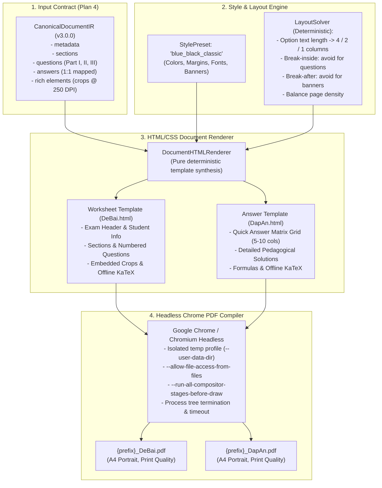

# Implementation Plan - PLAN 5: TASK-09 — Style Presets, Layout Engine & Two PDF Compilers

> **Task Focus**: `TASK-09 — Style Presets, Layout Engine, Two PDF Compilers` (Strictly TASK-09 only; no Visual QA repair or Orchestrator).  
> **Reference Specs**: `tasks/00_README.md`, `tasks/17_GLOBAL-RULES.md`, `tasks/11_TASK-09-STYLE-LAYOUT-AND-COMPILERS.md`, `docs/implementation-plan-04.md`, `docs/agent-handoff.md`.  
> **Output Artifact**: `docs/implementation-plan-05.md`.

---

## 1. Goal Description

Build the **deterministic document rendering and compilation engine** for DuyDev Studio's Quiz Module.  
Taking a fully validated `CanonicalDocumentIR` (Schema v3.0.0 produced in Plan 4) and a configurable `StylePreset` (`blue_black_classic`), the engine deterministically generates exactly two production-grade A4 PDF documents:
1. `{prefix}_DeBai.pdf`: The complete exam worksheet formatted with student metadata, section headers, instructions, questions, formulas, high-resolution source-cropped diagrams, and footer pagination.
2. `{prefix}_DapAn.pdf`: The answer and solution document containing a compact **Quick Answer Matrix (Bảng ma trận đáp án nhanh)** followed by detailed pedagogical solutions with mathematical/chemical evidence.

### Core Architecture Principles:
- **Style as Configuration, Never AI**: All styling rules, colors, fonts, margins, and banners are driven by declarative config presets (`StylePreset`). AI is strictly forbidden from writing freeform HTML or CSS.
- **Deterministic Layout Engine**: Code deterministically evaluates text length, formula density, and embedded images to decide whether multiple-choice options render in 1, 2, or 4 columns (`LayoutSolver`).
- **CSS Paged Media Pagination**: Paged Media standards (`@page`, `break-inside: avoid`, `break-after: avoid`, `orphans: 3; widows: 3;`) guarantee that questions are never awkwardly sliced across page folds and section headers never become orphans at the bottom of a page.
- **100% Offline KaTeX Rendering**: Math and chemical formulas render offline via bundled KaTeX assets (`engines/quiz/assets/katex/`) with local font fallbacks, zero external CDN dependencies, and Chromium flags allowing local asset access.
- **Deterministic Guarantee**: Given the same `CanonicalDocumentIR` + same `StylePreset`, the compiler produces byte-deterministic HTML and identical visual PDF output.



---

## 2. User Review Required

> [!IMPORTANT]
> **Deterministic Styling & No Arbitrary AI HTML**: As mandated by Global Rules 13 and 15, Agnes/AI will **NOT** be prompted to generate CSS or HTML layouts. All styling is encapsulated inside declarative Python preset classes (`StylePreset`) and deterministic Jinja2/string format templates.

> [!NOTE]
> **KaTeX Offline Asset Restoration**: KaTeX v0.16.11 assets (CSS, JS, auto-render, 20 `.woff2` font files) will be restored from git commit history into `engines/quiz/assets/katex/` to eliminate any CDN latency, network dependency, or offline print failure.

---

## 3. Proposed Changes

All work is contained within `engines/quiz/rendering/`, `engines/quiz/assets/`, and `engines/quiz/tests/`.

### Component: Style Presets (`engines/quiz/rendering/styles.py`)

#### [NEW] `engines/quiz/rendering/styles.py`
- Define `StylePreset` dataclass / Pydantic model:
  - `preset_id: str = "blue_black_classic"`
  - `display_name: str = "Blue Black Classic"`
  - `page_size: str = "A4 portrait"`
  - `margin_top_mm: float = 10.0`
  - `margin_right_mm: float = 12.0`
  - `margin_bottom_mm: float = 10.0`
  - `margin_left_mm: float = 12.0`
  - `primary_color: str = "#1e3a8a"` (Deep navy blue for headers, borders, banners)
  - `secondary_color: str = "#2563eb"` (Blue accent)
  - `text_color: str = "#0f172a"` (Slate-900 high-contrast body)
  - `muted_color: str = "#64748b"` (Slate-500 footers & instructions)
  - `border_color: str = "#cbd5e1"` (Slate-300 borders)
  - `banner_bg: str = "#1e3a8a"`
  - `banner_text_color: str = "#ffffff"`
  - `accent_bg: str = "#f8fafc"` (Subtle gray-blue background for student box & callouts)
  - `font_family_base: str = "'Roboto', 'Liberation Sans', 'DejaVu Sans', sans-serif"`
  - `font_size_pt: float = 10.0`
  - `line_height: float = 1.45`
  - `show_student_info: bool = True`
- Define `StyleRegistry`:
  - Maintains dictionary of registered presets.
  - `get(preset_id: str) -> StylePreset` (falls back to `blue_black_classic`).
  - Extensible: New design presets can be registered at runtime without altering core layout logic.

---

### Component: Layout Engine (`engines/quiz/rendering/layout.py`)

#### [NEW] `engines/quiz/rendering/layout.py`
- `LayoutSolver`:
  - `determine_option_columns(options: list[OptionIR], has_images: bool = False) -> int`:
    - If any option has an attached image or rich element: return `1` (full width `opt-col-1`).
    - Clean text of HTML tags and math delimiters (`$`).
    - Measure maximum text character length across options:
      - `max_len <= 15`: return `4` (`opt-col-4`, 4 options in 1 line).
      - `15 < max_len <= 45`: return `2` (`opt-col-2`, 2 options per line).
      - `max_len > 45`: return `1` (`opt-col-1`, 1 option per line).
  - `estimate_question_height_pt(question: QuestionIR, option_cols: int) -> float`:
    - Approximate height in points based on stem line wrap, rich element bounding boxes, and option rows.
  - `generate_layout_css(preset: StylePreset) -> str`:
    - Generates complete CSS Paged Media rules:
      - `@page` rule with A4 size and margins.
      - Running page headers and footers (`@bottom-left`, `@bottom-right` with `counter(page)` and `counter(pages)`).
      - `.question-item`: `break-inside: avoid; page-break-inside: avoid;` to keep questions cohesive.
      - `.section-banner`: `break-after: avoid; page-break-after: avoid;` to prevent orphan section headers.
      - Grid column styling: `.options-grid.opt-col-4`, `.opt-col-2`, `.opt-col-1`.

---

### Component: Document HTML Templates (`engines/quiz/rendering/templates.py`)

#### [NEW] `engines/quiz/rendering/templates.py`
- `render_worksheet_document(doc_ir: CanonicalDocumentIR, preset: StylePreset, katex_css_path: str, katex_js_path: str, katex_auto_render_path: str) -> str`:
  - Header block:
    - Exam title (`doc_ir.metadata.title`), Subject (`doc_ir.metadata.subject`), Grade (`doc_ir.metadata.grade`).
    - Exam code (`doc_ir.metadata.exam_code`), duration (`doc_ir.metadata.duration_minutes`), total questions (`doc_ir.metadata.total_questions`).
    - Student info box (Họ tên thí sinh, Lớp, SBD).
  - Section loop:
    - Section Banner: `PHẦN I. CÂU TRẮC NGHIỆM NHIỀU PHƯƠNG ÁN LỰA CHỌN`, `PHẦN II. CÂU TRẮC NGHIỆM ĐÚNG SAI`, `PHẦN III. CÂU TRẮC NGHIỆM TRẢ LỜI NGẮN`.
    - Instructions text (`instruction`).
  - Question loop:
    - Number badge (`Câu 1:`).
    - Stem text with normalized KaTeX and clean spacing.
    - Rich elements: render high-res cropped images (`` referencing relative path or file URL) with border and centering.
    - Render options:
      - Part I: Grid of 4 choices (A, B, C, D) with letter badge `.opt-letter`.
      - Part II: Sub-statements table / list with letters (a, b, c, d) and statement bodies.
      - Part III: Answer response line / blank.
  - Footer mark: `--- HẾT ---`.
  - Offline KaTeX initialization script before `</body>`.

- `render_answer_document(doc_ir: CanonicalDocumentIR, preset: StylePreset, katex_css_path: str, katex_js_path: str, katex_auto_render_path: str) -> str`:
  - Header block:
    - Title: `ĐÁP ÁN VÀ HƯỚNG DẪN GIẢI CHI TIẾT`.
    - Metadata: Subject, Total questions, Exam code.
  - Quick Answer Matrix Block (Bảng ma trận đáp án nhanh):
    - Multi-column compact table (5 to 10 question columns per row) showing `Câu` and `Đáp án` (e.g. `1. A | 2. C | 3. D | ...`).
    - Part II sub-answer matrix (e.g. `Câu 1: a-Đ, b-S, c-Đ, d-S`).
    - Part III short-answer values.
  - Detailed Pedagogical Solutions Block:
    - For each question:
      - Question header (`Câu {number}: Chọn đáp án {selected_answer}`).
      - Concise pedagogical evidence (`evidence`) displaying reaction equations, math formulas, and core rules.
      - Supporting diagrams or crops if present.
  - Footer mark: `--- HẾT ---`.
  - Offline KaTeX initialization script.

---

### Component: Document HTML Renderer (`engines/quiz/rendering/renderer.py`)

#### [NEW] `engines/quiz/rendering/renderer.py`
- `DocumentHTMLRenderer` class:
  - Takes `CanonicalDocumentIR` and `StylePreset`.
  - Resolves KaTeX asset paths (local relative paths or absolute file URIs).
  - Dispatches `render_worksheet()` $\rightarrow$ returns HTML string for worksheet.
  - Dispatches `render_answer_key()` $\rightarrow$ returns HTML string for answer document.
  - Pure function, side-effect free, 100% deterministic.

---

### Component: PDF Compiler (`engines/quiz/rendering/compiler.py`)

#### [NEW] `engines/quiz/rendering/compiler.py`
- `PDFCompiler` class:
  - `find_chrome_path() -> str`:
    - Checks `QUIZ_CHROME_PATH` environment variable.
    - Scans standard system paths:
      - Windows: `C:\Program Files\Google\Chrome\Application\chrome.exe`, `C:\Program Files (x86)\...`, `%LOCALAPPDATA%\Google\Chrome\...`, `C:\Program Files (x86)\Microsoft\Edge\Application\msedge.exe`.
      - Linux: `/usr/bin/google-chrome`, `/usr/bin/chromium`, `/usr/bin/chromium-browser`, `/snap/bin/chromium`.
      - macOS: `/Applications/Google Chrome.app/Contents/MacOS/Google Chrome`.
    - Raises informative `RuntimeError` if no compatible headless browser is located.
  - `compile_html_to_pdf(html_path: str, pdf_path: str, timeout: float = 45.0) -> None`:
    - Creates isolated temporary user data profile directory per job (`--user-data-dir`).
    - Launches Chrome CLI process with print arguments:
      ```python
      cmd = [
          chrome_path,
          "--headless=new",
          "--disable-gpu",
          "--no-sandbox",
          "--disable-dev-shm-usage",
          "--disable-crash-reporter",
          "--disable-breakpad",
          "--no-first-run",
          "--no-default-browser-check",
          "--disable-background-networking",
          "--disable-extensions",
          "--disable-default-apps",
          "--disable-sync",
          "--mute-audio",
          "--allow-file-access-from-files",
          "--run-all-compositor-stages-before-draw",
          "--virtual-time-budget=8000",
          "--disable-features=NetworkService",
          f"--user-data-dir={temp_profile}",
          "--no-pdf-header-footer",
          f"--print-to-pdf={abs_pdf}",
          file_url
      ]
      ```
    - Fallback: If `--headless=new` is unsupported on older Chrome versions, retry once with legacy `--headless`.
    - Safety: Polls file generation and enforces process timeout; cleanly terminates process tree with `psutil` or `subprocess.Popen.terminate()` / `kill()`.
    - Verifies generated PDF:
      - File exists.
      - File size $> 1024$ bytes.
      - PyMuPDF opens successfully (`fitz.open(pdf_path)`) and page count $\ge 1$.
  - `compile_both(doc_ir: CanonicalDocumentIR, output_dir: str, prefix: str, style_preset_id: str = "blue_black_classic") -> tuple[str, str]`:
    - Main entry point for TASK-09.
    - Sanitizes `{prefix}` against filesystem special characters.
    - Ensures KaTeX directory is mirrored/available in `output_dir/katex`.
    - Writes `{output_dir}/{prefix}_DeBai.html` and `{output_dir}/{prefix}_DapAn.html`.
    - Compiles to `{output_dir}/{prefix}_DeBai.pdf`.
    - Compiles to `{output_dir}/{prefix}_DapAn.pdf`.
    - Returns `(debai_pdf_path, dapan_pdf_path)`.

---

### Component: KaTeX Offline Assets Restoration

#### [RESTORE] `engines/quiz/assets/katex/`
- Restore KaTeX offline bundle from Git HEAD:
  - `engines/quiz/assets/katex/katex.min.css`
  - `engines/quiz/assets/katex/katex.min.js`
  - `engines/quiz/assets/katex/contrib/auto-render.min.js`
  - `engines/quiz/assets/katex/fonts/*.woff2` (KaTeX AMS, Main, Math, SansSerif, Size, etc.)
- Vendor location verified: `engines/quiz/assets/katex/`.

---

### Component: Package Exports (`engines/quiz/rendering/__init__.py`)

#### [NEW] `engines/quiz/rendering/__init__.py`
- Expose:
  - `StylePreset`, `StyleRegistry`, `BLUE_BLACK_CLASSIC_STYLE`
  - `LayoutSolver`
  - `DocumentHTMLRenderer`
  - `PDFCompiler`

---

## 4. Verification Plan

### 4.1. Automated Unit Tests (`engines/quiz/tests/`)

1. **`test_styles.py`**:
   - `test_default_blue_black_classic`: Verify color codes, typography, page margins, and banner settings.
   - `test_style_registry_lookup`: Verify fallback to default preset when unknown preset ID is requested.
   - `test_custom_style_registration`: Verify dynamic addition of a new preset.

2. **`test_layout.py`**:
   - `test_option_columns_4_cols`: Short options ($\le 15$ chars) resolve to `4` columns.
   - `test_option_columns_2_cols`: Medium options ($16 - 45$ chars) resolve to `2` columns.
   - `test_option_columns_1_col`: Long options ($> 45$ chars) resolve to `1` column.
   - `test_option_columns_with_images`: Options with embedded images resolve strictly to `1` column.
   - `test_paged_media_css_generation`: Verify generated CSS contains `break-inside: avoid`, `break-after: avoid`, and `@page` rules.

3. **`test_renderer.py`**:
   - `test_render_worksheet_html`: Verify generation of complete Worksheet HTML document from `CanonicalDocumentIR`.
   - `test_render_answer_key_html`: Verify generation of complete Answer HTML document.
   - `test_quick_matrix_table_generation`: Verify quick answer matrix correctly displays Part I answers and Part II/III items.
   - `test_katex_formula_preservation`: Verify math `$x^2 + y^2 = r^2$` and chemical formulas remain unescaped for KaTeX auto-render.
   - `test_source_crop_image_rendering`: Verify `` tags with proper alt text and classes.
   - `test_deterministic_html_output`: Verify identical IR + preset yields character-identical HTML output across multiple runs.

4. **`test_compiler.py`**:
   - `test_find_chrome_path`: Verify Chrome executable discovery on the test machine.
   - `test_compile_worksheet_and_answer_pdf`:
     - Run `PDFCompiler.compile_both()` on a sample `CanonicalDocumentIR`.
     - Verify `{prefix}_DeBai.pdf` and `{prefix}_DapAn.pdf` are generated.
     - Open both files via PyMuPDF: verify page count $\ge 1$, page dimensions are A4 portrait ($595.28 \times 841.89$ pt), and content is non-empty.

### 4.2. Test Execution Command
```bash
python -m unittest discover -s engines/quiz/tests -p "test_*.py" -v
```
All existing 53 tests + new tests (approx. 18-20 new tests) must pass 100%.

### 4.3. Full Pipeline Server Typecheck & Vitest
```bash
cd server && npx tsc --noEmit
cd server && npx vitest run
```

---

## 5. Acceptance Criteria Checklist

- [ ] **Exact 2 PDFs**: Compilation produces exactly `{prefix}_DeBai.pdf` and `{prefix}_DapAn.pdf`.
- [ ] **Style Preset System**: Declarative preset `blue_black_classic` dictates styling; 0 freeform AI CSS.
- [ ] **Deterministic Layout Solver**: Code deterministically chooses 1, 2, or 4 columns based on option lengths and image presence.
- [ ] **Paged Media Pagination**: Questions protected by `break-inside: avoid`; section headers protected by `break-after: avoid`; no orphan headers.
- [ ] **Worksheet Fidelity**: Full title, student info box, section banners, numbered questions, rich elements, and footer page numbering.
- [ ] **Answer Key Fidelity**: Includes **Quick Answer Matrix (Bảng ma trận đáp án nhanh)** followed by detailed pedagogical solutions with mathematical/chemical evidence.
- [ ] **Offline KaTeX**: KaTeX assets restored locally, rendering formulas offline without CDN dependencies.
- [ ] **A4 Standard**: Both PDFs conform strictly to A4 portrait dimensions ($595 \times 842$ pt) with 0 clipping or missing content.
- [ ] **Deterministic Execution**: Same IR + same style preset $\rightarrow$ deterministic output.
- [ ] **Scope Enforced**: Zero QA repair loop (TASK-10) or orchestrator code included.
