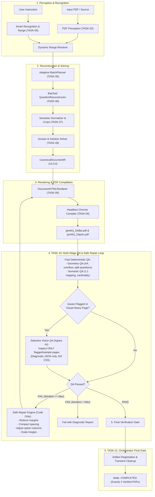

# Implementation Plan - PLAN 6: TASK-10 & TASK-11 — QA, Safe Repair & Pipeline Orchestrator

> **Task Focus**:  
> - `TASK-10 — Geometry QA, Semantic QA, Visual QA & Safe Repair Loop`  
> - `TASK-11 — Pipeline Orchestrator & Job State Management`  
> **Reference Specs**: `tasks/00_README.md`, `tasks/17_GLOBAL-RULES.md`, `tasks/12_TASK-10-QA-AND-REPAIR.md`, `tasks/13_TASK-11-ORCHESTRATOR.md`, `docs/implementation-plan-05.md`, `docs/agent-handoff.md`.  
> **Output Artifact**: `docs/implementation-plan-06.md`.

---

## 1. Goal Description

Establish the **QA, Self-Healing Repair, and End-to-End Pipeline Orchestration Layer** for DuyDev Studio's Quiz Module.  
This layer connects all components built across Plans 1–5 into a unified, stateful, resumable, and fault-tolerant background execution engine.

### Core Architecture Principles:
1. **Never Trust a Successful Render**: Generating a PDF without errors does not mean the output is publication-ready. Every compiled document must pass a multi-stage QA inspection.
2. **Fast Deterministic QA First**: Code checks geometry (margins, overflow, clipping, overlap, split questions, orphan headings) and semantics (1:1 question-answer mapping, option cardinality, sequential numbers) before calling AI.
3. **Selective Vision QA (Never Full Document Vision)**: Agnes Vision is called **strictly and only** on pages flagged by Geometry QA, representative sample pages (e.g. Page 1), or rich-element-dense pages. Full-document vision scanning is explicitly banned (Global Rule 17).
4. **Diagnostic AI, Safe Code-Driven Repair**: Agnes outputs only diagnostic structured JSON (`issues: [...]`). Agnes is **strictly forbidden from writing CSS or layout code** (Global Rule 13). Code translates diagnostic feedback into discrete, predefined styling adjustments (margin reduction, spacing compaction, option column shifts, image scaling).
5. **Configurable Repair Limit**: Repair loops are capped at 2–3 iterations. If problems persist, the job fails gracefully with a transparent diagnostic report (`QA_FAILED`), preventing infinite loops or token exhaustion.
6. **Stateful, Resumable Orchestration**: A 13-state deterministic finite-state machine (`JobState`) with atomic JSON persistence, idempotent progress reporting, and a strict **Final Gate** that guarantees `COMPLETED` is only reached when both `{prefix}_DeBai.pdf` and `{prefix}_DapAn.pdf` exist, pass semantic QA, and pass geometry QA.



---

## 2. User Review Required

> [!IMPORTANT]
> **No AI-Generated CSS**: Global Rules 13 & 15 strictly prohibit Agnes from outputting CSS or entire HTML documents. Agnes only returns diagnostic structured JSON (`QAIssue`). The `SafeRepairEngine` in Python translates these issues into deterministic parameter modifications (e.g. shrinking margins by $1.5\text{mm}$, condensing option spacing, or reducing crop scale).

> [!NOTE]
> **Selective Vision QA Boundary**: Vision AI will inspect a maximum of 1 to 2 selected pages per document (flagged pages or Page 1 sample). It will **never** scan every page of a multi-page document by default, saving up to 85% of AI vision tokens and eliminating latency.

---

## 3. Proposed Changes

All components will be created in `engines/quiz/qa/`, `engines/quiz/orchestrator/`, and `engines/quiz/tests/`.

---

### Component: Multi-Stage QA Engine (`engines/quiz/qa/`)

#### [NEW] `engines/quiz/qa/models.py`
Pydantic v2 data models for QA issues, diagnostics, and reports:
```python
from enum import Enum
from typing import Optional
from pydantic import BaseModel, Field

class QAIssueType(str, Enum):
    OVERFLOW = "overflow"                 # Content extends into page margins or bottom zone
    OVERLAP = "overlap"                   # Elements overlapping each other
    BAD_SPACING = "bad_spacing"           # Excessive whitespace or abnormal line gap
    BROKEN_FORMULA = "broken_formula"     # Unrendered KaTeX syntax or raw tags
    BAD_CROP = "bad_crop"                 # Blurry, clipped, or corrupted image crop
    SPLIT_QUESTION = "split_question"     # Question broken across page boundary
    ORPHAN_HEADING = "orphan_heading"     # Section heading at page bottom without content
    CARDINALITY_MISMATCH = "cardinality_mismatch" # Incorrect option/statement count
    ANSWER_MISMATCH = "answer_mismatch"   # Question missing from answer key or 1:1 mismatch
    MISSING_FILE = "missing_file"         # Target PDF missing or empty (< 1024 bytes)
    OTHER = "other"

class QASeverity(str, Enum):
    LOW = "low"         # Informational / minor aesthetic
    MEDIUM = "medium"   # Noticeable spacing/margin issue
    HIGH = "high"       # Broken layout, split question, or overlapping text
    CRITICAL = "critical" # Missing answers, file compilation failure

class QAIssue(BaseModel):
    page: int                             # 1-based human page number (0 if document-wide)
    type: QAIssueType
    severity: QASeverity
    description: str
    bbox: Optional[tuple[float, float, float, float]] = None

class GeometryQAResult(BaseModel):
    status: str = "PASS"                  # "PASS" | "WARN" | "FAIL"
    issues: list[QAIssue] = Field(default_factory=list)
    page_count: int = 1
    is_a4_compliant: bool = True

class SemanticQAResult(BaseModel):
    status: str = "PASS"                  # "PASS" | "FAIL"
    issues: list[QAIssue] = Field(default_factory=list)
    total_questions: int = 0
    matched_answers: int = 0
    is_sequence_valid: bool = True

class VisionQAResult(BaseModel):
    status: str = "PASS"                  # "PASS" | "FAIL"
    issues: list[QAIssue] = Field(default_factory=list)
    inspected_pages: list[int] = Field(default_factory=list)

class OverallQAResult(BaseModel):
    status: str = "PASS"                  # "PASS" | "WARN" | "FAIL"
    geometry: GeometryQAResult
    semantic: SemanticQAResult
    vision: Optional[VisionQAResult] = None
    requires_repair: bool = False
    repair_suggestions: list[str] = Field(default_factory=list)
```

#### [NEW] `engines/quiz/qa/geometry_qa.py`
Code-first geometric verification using PyMuPDF:
- `validate_pdf_geometry(pdf_path: str, margins_mm: tuple[float, float, float, float] = (10, 12, 10, 12)) -> GeometryQAResult`:
  1. **Page Size Check**: Verifies all pages are standard A4 portrait ($595.28 \times 841.89$ pt, delta $\le 5$ pt).
  2. **Content Boundary & Margin Clearance**:
     - Extracts text blocks and drawings via `page.get_text("blocks")` and `page.get_drawings()`.
     - Checks whether content extends past the bottom margin zone ($841.89 - 10\text{mm} = 813.5\text{ pt}$), ignoring running footer blocks at $y \ge 815\text{ pt}$.
  3. **Split Question Detection**:
     - Scans text blocks for `Câu \d+:` markers.
     - Detects if a question stem starts in the bottom $35\text{pt}$ of page $N$ while its options appear on page $N+1$.
  4. **Orphan Heading Detection**:
     - Detects section banners (`PHẦN I`, `PHẦN II`) located within the bottom $45\text{pt}$ of content area with no question body underneath.
  5. **Excessive Trailing Whitespace / Blank Page**:
     - Detects if the last page has less than $30$ characters of content or is an accidental trailing blank page.

#### [NEW] `engines/quiz/qa/semantic_qa.py`
Rigorous document semantic integrity verification:
- `validate_semantic_integrity(doc_ir: CanonicalDocumentIR, debai_pdf: str, dapan_pdf: str) -> SemanticQAResult`:
  1. **File Existence & Non-Trivial Size**:
     - Both `{prefix}_DeBai.pdf` and `{prefix}_DapAn.pdf` must exist on disk and be $> 1024$ bytes.
  2. **1:1 Question-Answer Mapping**:
     - Every `QuestionIR.id` must have an exact match in `AnswerKeyIR.question_id`.
     - Count of questions in Worksheet must equal count of answers in Answer Key.
  3. **Sequential Numbering**:
     - Question numbers must strictly form a continuous sequence $1, 2, 3, \dots, N$.
  4. **Option Cardinality**:
     - Part I questions must contain 2–4 options (typically 4: A, B, C, D).
     - Part II questions must contain 4 sub-statements (a, b, c, d).
     - Part III questions must contain a valid answer value.

#### [NEW] `engines/quiz/qa/vision_qa.py`
Selective visual inspection using Agnes AI:
- `run_selective_vision_qa(pdf_path: str, flagged_pages: list[int], rich_element_pages: list[int], provider: AgnesAIProvider | MockAIProvider) -> VisionQAResult`:
  1. **Target Page Selection**:
     - Selects pages flagged with geometry warnings.
     - Adds representative Page 1 (where exam title and student info box reside).
     - Adds rich-element-dense pages.
     - **Caps total pages to 1–2 pages max**. If 0 pages flagged, inspects only Page 1.
  2. **Page Rendering**:
     - Renders target pages to high-resolution PNG bytes via `page.get_pixmap(dpi=150)`.
  3. **Agnes AI Provider Call**:
     - Uses 6-block `PromptBuilder` with structured Pydantic schema `VisionQAResult`.
     - Prompt instructs AI:
       - Act as a visual QA inspector for Vietnamese exam worksheets.
       - Check for text collisions, cut-off formulas, overlapping images, or unreadable typography.
       - Return only diagnostic JSON (`PASS` or `FAIL` + list of `QAIssue`).
       - **Strictly do not output CSS or code**.

#### [NEW] `engines/quiz/qa/repair.py`
Deterministic parameter adjustment engine:
- `SafeRepairEngine`:
  - `evaluate_and_repair(doc_ir: CanonicalDocumentIR, style_preset: StylePreset, qa_result: OverallQAResult, current_iteration: int, max_iterations: int = 2) -> tuple[CanonicalDocumentIR, StylePreset, bool]`:
    - Checks `qa_result.requires_repair`.
    - If `current_iteration >= max_iterations`: returns `(doc_ir, style_preset, False)` (no more repairs).
    - If `QAIssueType.OVERFLOW` detected:
      - Reduces page margins from $10/12\text{mm}$ to $8/10\text{mm}$.
      - Reduces body font size from $10.0\text{pt}$ to $9.5\text{pt}$ and line height from $1.45$ to $1.35$.
      - Scales down crop max-heights in `LayoutSolver`.
    - If `QAIssueType.SPLIT_QUESTION` or `BAD_SPACING` detected:
      - Adjusts option columns: forces 4 columns for short/medium options to save vertical lines.
      - Compacts question bottom margin from $9\text{pt}$ to $6.5\text{pt}$.
    - If `QAIssueType.BAD_CROP` detected:
      - Switches to fallback crop image or centers crop diagram.
    - Returns updated `(new_doc_ir, new_style_preset, True)` to trigger re-rendering.

#### [NEW] `engines/quiz/qa/__init__.py`
Exports public interfaces: `validate_pdf_geometry`, `validate_semantic_integrity`, `run_selective_vision_qa`, `SafeRepairEngine`, and QA data models.

---

### Component: Pipeline Orchestrator & Job State (`engines/quiz/orchestrator/`)

#### [NEW] `engines/quiz/orchestrator/state.py`
Finite State Machine and Job State Persistence:
- `JobStage` Enum:
  - `CREATED`
  - `INSPECTING`
  - `PLANNING`
  - `RECONSTRUCTING`
  - `NORMALIZING`
  - `SOLVING`
  - `RENDERING`
  - `COMPILING`
  - `QA`
  - `REPAIRING`
  - `FINALIZING`
  - `COMPLETED`
  - `FAILED`
- `JobState` Model:
  - `job_id: str`
  - `current_stage: JobStage`
  - `progress_pct: int` (0–100)
  - `message: str`
  - `error: Optional[str] = None`
  - `repair_iteration: int = 0`
  - `max_repair_iterations: int = 2`
  - `created_at: str`
  - `updated_at: str`
  - `artifacts: dict[str, str]` (`debai_pdf`, `dapan_pdf`, `worksheet_html`, `answer_html`, `qa_report`)
  - `diagnostics: list[dict]`
- `JobStateManager`:
  - `save(state: JobState, state_file_path: str)` (Atomic JSON file write).
  - `load(state_file_path: str) -> JobState`.

#### [NEW] `engines/quiz/orchestrator/pipeline.py`
End-to-End Orchestrator connecting all submodules:
- `QuizPipelineOrchestrator`:
  - `run(pdf_path: str, instruction: str, output_dir: str, prefix: str = "DeThi", provider: AgnesAIProvider = None, on_progress: Callable = None) -> JobState`:
    1. **STAGE: CREATED $\rightarrow$ INSPECTING (0%–15%)**:
       - Extracts `PageRepresentation` list via `PDFPerceptionLayer` (TASK-03).
    2. **STAGE: PLANNING (15%–30%)**:
       - Resolves page range via `RangeResolver` & `RuleParser` (TASK-05).
       - Classifies complexity and creates batches via `BatchPlanner` (TASK-06).
    3. **STAGE: RECONSTRUCTING (30%–50%)**:
       - Reconstructs questions via `QuestionReconstructor` with adaptive micro-batching (TASK-06).
       - Applies `PostProcessor` (dedup & $1..N$ sequential renumbering).
    4. **STAGE: NORMALIZING & SOLVING (50%–70%)**:
       - Normalizes math/chemistry/units via `ContentNormalizer` (TASK-07).
       - Extracts high-res crops @ 250 DPI via `crop_pdf_region` (TASK-07).
       - Solves answers and pedagogical evidence via `AnswerSolver` (TASK-08).
       - Assembles and validates `CanonicalDocumentIR` via `CanonicalIRBuilder` (TASK-07).
    5. **STAGE: RENDERING & COMPILING (70%–85%)**:
       - Renders deterministic HTML for Worksheet and Answer Key (TASK-09).
       - Compiles `{prefix}_DeBai.pdf` and `{prefix}_DapAn.pdf` via `PDFCompiler` (TASK-09).
    6. **STAGE: QA & REPAIR LOOP (85%–95%)**:
       - Runs Fast Geometry QA on both PDFs.
       - Runs Semantic QA.
       - Runs Selective Vision QA on flagged or representative pages.
       - If QA fails and iteration $<$ max:
         - State $\rightarrow$ `REPAIRING`.
         - Calls `SafeRepairEngine` to adjust layout parameters.
         - Loops back to Re-render and Re-compile.
    7. **STAGE: FINALIZING $\rightarrow$ COMPLETED (95%–100%)**:
       - **Strict Final Gate**:
         - Confirms `{prefix}_DeBai.pdf` exists and $> 1024$ bytes.
         - Confirms `{prefix}_DapAn.pdf` exists and $> 1024$ bytes.
         - Confirms `semantic_qa.status == "PASS"`.
         - Confirms `geometry_qa.status in ["PASS", "WARN"]`.
       - Cleans up temporary profiles, scratch dumps, and unneeded raster intermediates.
       - Sets `current_stage = JobStage.COMPLETED`.

#### [NEW] `engines/quiz/orchestrator/__init__.py`
Exports `QuizPipelineOrchestrator`, `JobStage`, `JobState`, and `JobStateManager`.

---

## 4. Verification Plan

### 4.1. Automated Unit Tests (`engines/quiz/tests/`)

1. **`test_geometry_qa.py`**:
   - `test_valid_a4_dimensions_pass`: A standard $595.28 \times 841.89$ pt PDF passes with 0 issues.
   - `test_non_a4_dimensions_flagged`: Non-standard dimensions trigger a `CRITICAL` issue.
   - `test_margin_overflow_detection`: Simulated text extending into margin zones triggers `OVERFLOW`.
   - `test_split_question_detection`: Question marker near page bottom triggers `SPLIT_QUESTION` warning.
   - `test_blank_page_detection`: Empty page triggers `BAD_SPACING` warning.

2. **`test_semantic_qa.py`**:
   - `test_full_integrity_pass`: Valid `CanonicalDocumentIR` matching both existing PDFs passes 100%.
   - `test_missing_file_fails`: Missing or empty PDF triggers `MISSING_FILE` failure.
   - `test_answer_mismatch_fails`: Omitted answer key record triggers `ANSWER_MISMATCH`.
   - `test_non_sequential_numbers_flagged`: Non-sequential question numbering triggers issue.

3. **`test_vision_qa.py`**:
   - `test_selective_page_targeting`: Verifies that only flagged/sample pages are targeted (maximum 1–2 pages, never all pages).
   - `test_vision_qa_mock_parsing`: Mock Agnes diagnostic response parses correctly into `VisionQAResult`.

4. **`test_repair.py`**:
   - `test_safe_repair_overflow_reduces_margins`: Overflow issue triggers margin & line-height reduction.
   - `test_safe_repair_preserves_semantics`: Safe repair never alters question stems, option text, or answers.
   - `test_max_repair_iterations_enforced`: Stops attempting repairs once max iterations limit is reached.

5. **`test_orchestrator.py`**:
   - `test_orchestrator_end_to_end_success`: Complete run from sample PDF and prompt to `COMPLETED` state producing exactly 2 verified PDFs.
   - `test_orchestrator_state_persistence`: Verifies `job_state.json` updates and reflects accurate progress.
   - `test_orchestrator_repair_self_healing`: Injected overflow issue triggers repair loop and succeeds on iteration 2.
   - `test_orchestrator_final_gate_rejection`: Corrupted or missing output PDF prevents `COMPLETED` state.

### 4.2. Automated Test Commands
```bash
python -m unittest discover -s engines/quiz/tests -p "test_*.py" -v
```
All existing 69 tests + new tests (approx. 20 new tests) must pass 100%.

### 4.3. Server Build & Vitest Verification
```bash
cd server && npx tsc --noEmit
cd server && npx vitest run
```

---

## 5. Acceptance Criteria Checklist

- [ ] **Multi-Stage QA Pipeline**: Code-first Geometry QA + Semantic QA run before any vision calls.
- [ ] **Selective Vision QA**: Agnes Vision is called strictly on flagged/sample pages (never all pages by default).
- [ ] **Zero AI CSS**: Agnes returns diagnostic structured JSON only; repair is executed by Python code modifying layout/preset parameters.
- [ ] **Safe Repair Limits**: Repair loop iterations are configurable (capped at 2–3); stops cleanly on `QA_FAILED` if unresolvable.
- [ ] **13-State Machine**: Pipeline transitions deterministically through all stages with atomic state persistence.
- [ ] **Strict Final Gate**: `COMPLETED` state requires:
  - `{prefix}_DeBai.pdf` exists and $> 1024$ bytes.
  - `{prefix}_DapAn.pdf` exists and $> 1024$ bytes.
  - Semantic QA passes (1:1 question-answer match, sequential numbers, option cardinality).
  - Geometry QA passes (standard A4 dimensions, no fatal overflow).
- [ ] **Transient Cleanup**: Removes temporary profiles and scratch dumps while preserving final PDFs and diagnostic logs.
