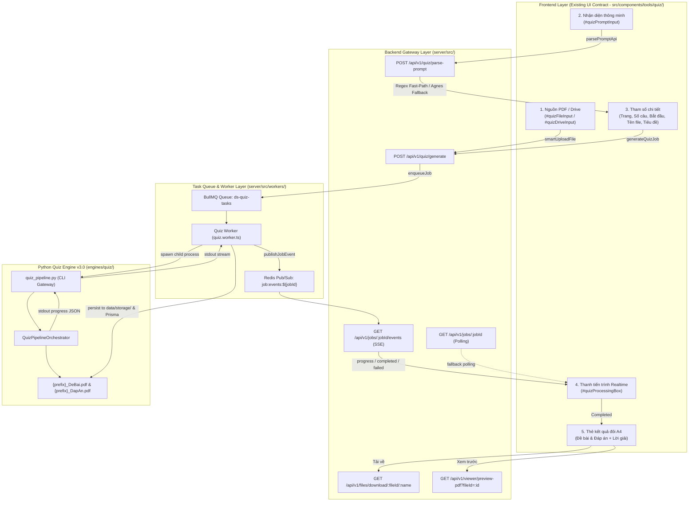

# Implementation Plan — PLAN 7: TASK-12 UI Integration

> **Mã công việc**: `PLAN 7 — TASK-12 (Integrate Existing UI)`  
> **Tài liệu tham chiếu**: `tasks/00_README.md`, `tasks/17_GLOBAL-RULES.md`, `tasks/14_TASK-12-UI-INTEGRATION.md`, `docs/current-module-audit.md`, `docs/implementation-plan-06.md`, `docs/agent-handoff.md`  
> **Mục tiêu**: Gắn kết toàn bộ backend pipeline đã hoàn thiện (Orchestrator v3.0, QA Loop, Layout Engine, PDF Compilers) vào giao diện người dùng hiện tại (UI Contract).  
> **Ràng buộc thép (Global Rules 1 & 3)**: TUYỆT ĐỐI KHÔNG redesign, không đổi layout, không đổi style CSS, không tạo lại frontend, không thay đổi UX nếu không cần thiết.

---

## 1. Kiến Trúc Tích Hợp Tổng Thể (Architecture Overview)



---

## 2. Bảng Ánh Xạ 14 Thành Phần Giao Diện Sang Backend (UI-to-Backend Mapping)

| # | Thành phần UI | Vị trí DOM / Component | Giao thức / Endpoint Backend | Xử lý & Dữ liệu tương ứng |
|---|---|---|---|---|
| **1** | **Upload PDF** | `#quizDropzone`, `#quizFileInput` (`QuizConfigPanel.js`) | `POST /api/v1/files/upload` (`smartUploadFile`) | Lưu tệp vào `data/storage/`, tạo bản ghi `prisma.fileRecord`. Trả về `fileId`. Frontend lưu `state.fileId`. |
| **2** | **Google Drive URL** | `#quizDriveInput` (`QuizConfigPanel.js`) | Gửi trực tiếp trong payload `POST /api/v1/quiz/generate` (`gdriveUrl`) | Worker xác thực link Google Drive, tải tệp trực tiếp dạng stream xuống thư mục tạm trước khi gọi engine. |
| **3** | **Nhận diện thông minh** | `#quizPromptInput`, `#btnQuizParsePrompt` | `POST /api/v1/quiz/parse-prompt` | Fast-path regex bóc tách trang, số câu, câu bắt đầu, tên file, tiêu đề. Trả về JSON, frontend tự điền vào các ô form (Step 3). |
| **4** | **Trang trích xuất** | `#quizPagesInput` (`QuizConfigPanel.js`) | Trường `pages` trong `createQuizJobSchema` | Chuyển thành tham số `--pages` và dải trang `[start_page .. end_page]` cho `RangeResolver` / `BatchPlanner`. |
| **5** | **Số lượng câu** | `#quizCountInput` (min: 1, max: 200, default: 20) | Trường `count` trong `createQuizJobSchema` | Chuyển thành tham số `--count` cho `BatchPlanner` và `PostProcessor.expected_count`. |
| **6** | **Bắt đầu từ câu** | `#quizStartInput` (min: 1, max: 500, default: 1) | Trường `startNum` (alias `start`) | Chuyển thành tham số `--start-num` để đánh số thứ tự tuần tự chuẩn `1..N` từ số bắt đầu. |
| **7** | **Tên file** | `#quizPrefixInput` (Bắt buộc, sanitized) | Trường `prefix` trong `createQuizJobSchema` | Dùng làm tiền tố chuẩn hóa `{prefix}_DeBai.pdf` và `{prefix}_DapAn.pdf`. |
| **8** | **Tiêu đề** | `#quizTitleInput` (default: "BÀI TẬP TRẮC NGHIỆM") | Trường `title` trong `createQuizJobSchema` | Truyền vào `DocumentMetadataIR.title` hiển thị trên đầu trang A4 đầu tiên. |
| **9** | **Style Preset** | Cấu hình mặc định hoặc tham số `stylePresetId` | Trường `stylePresetId` (default: `blue_black_classic`) | Nạp `StylePreset` tương ứng từ `style_registry` trong Python renderer. |
| **10** | **Progress Realtime** | `#quizProcessingBox`, `#quizProgressBar`, `#quizProgressText` | `GET /api/v1/jobs/:jobId/events` (SSE) + `GET /api/v1/jobs/:jobId` (Poll) | Python orchestrator phát JSON ra stdout; Worker bắt và bắn Pub/Sub; SSE đẩy về UI hiển thị % và thông điệp tiếng Việt. |
| **11** | **Đề bài A4** | Worksheet Card trong `QuizResultCard.js` | Tệp `{prefix}_DeBai.pdf` (artifact lưu trong `prisma.fileRecord`) | Hiển thị tên file, số trang A4, số lượng câu, huy hiệu hình ảnh, kích thước tệp. |
| **12** | **Đáp án & Lời giải** | Answer Key Card trong `QuizResultCard.js` | Tệp `{prefix}_DapAn.pdf` (artifact lưu trong `prisma.fileRecord`) | Hiển thị tên file, số trang A4, số lượng câu, kích thước tệp. |
| **13** | **Preview (Xem trước)** | Nút `.btn-quiz-preview` (`QuizResultCard.js`) | `/api/v1/viewer/preview-pdf?fileId=${fileId}` hoặc `/api/v1/files/view/${fileId}` | Mở modal Universal Viewer của hệ thống xem tài liệu trực tiếp trên trình duyệt không cần tải về. |
| **14** | **Download (Tải về)** | Nút `.btn-quiz-download` (`QuizResultCard.js`) | `/api/v1/files/download/${fileId}/${encodedName}?filename=${encodedName}` | Trả về file stream với header `Content-Disposition: attachment; filename=...`. |

---

## 3. Chi Tiết Các Endpoints Backend & Contracts Dữ Liệu

### 3.1. Endpoint 1: Smart Recognition (`POST /api/v1/quiz/parse-prompt`)
- **Mục đích**: Nhận chuỗi ngôn ngữ tự nhiên từ người dùng, bóc tách cấu trúc và trả về kế hoạch trích xuất.
- **Request Body Schema**:
  ```typescript
  export const parsePromptSchema = z.object({
    prompt: z.string().optional(),
    instruction: z.string().optional(),
    fileId: z.string().optional()
  }).refine((data) => Boolean(data.prompt?.trim() || data.instruction?.trim()), {
    message: 'Vui lòng nhập câu lệnh nhận diện'
  });
  ```
- **Xử lý**:
  - Chuẩn hóa đầu vào (`promptText = instruction || prompt`).
  - **Fast Path (Deterministic Regex)**: Áp dụng thuật toán bóc tách regex tối ưu từ `rule_parser.py`:
    - Dải trang: `Trang 11-15`, `Trang 11 đến 15`, `Trang 11`.
    - Dải câu: `từ câu 1 đến câu 20`, `câu 1 đến 20` $\rightarrow$ `start: 1`, `count: 20`.
    - Số câu rời rạc: `lấy 25 câu`, `25 câu` $\rightarrow$ `count: 25`.
    - Câu bắt đầu: `từ câu 5`, `bắt đầu từ câu 5` $\rightarrow$ `start: 5`.
    - Tên file / chủ đề: `Ester Lipid`, `chủ đề Este` $\rightarrow$ `prefix: "Ester_Lipid"`.
    - Tiêu đề in ấn: Tự sinh dựa trên trang hoặc chủ đề.
  - **AI Fallback (Chỉ khi câu lệnh hoàn toàn mơ hồ)**: Gọi Agnes AI trích xuất JSON. Tuyệt đối không để rò rỉ API key ra client.
- **Response**:
  ```json
  {
    "success": true,
    "data": {
      "pages": "11",
      "count": 20,
      "start": 1,
      "title": "BÀI TẬP TRẮC NGHIỆM TRANG 11",
      "prefix": "HoaHoc12",
      "confidence": 1.0,
      "warnings": [],
      "source": "regex"
    }
  }
  ```

---

### 3.2. Endpoint 2: Generate Quiz Job (`POST /api/v1/quiz/generate`)
- **Mục đích**: Nhận tham số cấu hình, xác thực chặt chẽ, tạo bản ghi `Job` và đưa vào hàng đợi BullMQ.
- **Request Body Schema**:
  ```typescript
  export const createQuizJobSchema = z
    .object({
      fileId: z.string().optional(),
      gdriveUrl: z.string().optional(),
      driveUrl: z.string().optional(),
      pages: z.string().min(1, 'Vui lòng cung cấp phạm vi trang cần trích xuất'),
      count: z.number().int().min(1).max(200).default(20),
      startNum: z.number().int().min(1).optional(),
      start: z.number().int().min(1).optional(),
      title: z.string().min(1).default('BÀI TẬP TRẮC NGHIỆM'),
      subtitle: z.string().optional().default(''),
      prefix: z.string().trim().min(1, 'Vui lòng nhập Tên File (Bắt buộc)'),
      stylePresetId: z.string().optional().default('blue_black_classic')
    })
    .transform((data) => ({
      ...data,
      gdriveUrl: data.gdriveUrl || data.driveUrl,
      startNum: data.startNum || data.start || 1
    }))
    .refine((data) => Boolean(data.fileId || data.gdriveUrl), {
      message: 'Cần cung cấp tệp PDF nguồn (fileId) hoặc liên kết Google Drive (gdriveUrl)'
    });
  ```
- **Xử lý**:
  1. Kiểm tra tồn tại và tính hợp lệ của `fileId` trong `prisma.fileRecord`.
  2. Tạo bản ghi `prisma.job` với `type = 'quiz_generate'`, `status = 'QUEUED'`.
  3. Đẩy vào BullMQ `ds-quiz-tasks` với payload chứa đầy đủ thông số.
  4. Trả về mã HTTP 202 Accepted.
- **Response**:
  ```json
  {
    "success": true,
    "data": {
      "jobId": "job_1791114658_a1b2c3d4",
      "status": "QUEUED",
      "eventsUrl": "/api/v1/jobs/job_1791114658_a1b2c3d4/events",
      "pollUrl": "/api/v1/jobs/job_1791114658_a1b2c3d4"
    }
  }
  ```

---

### 3.3. Endpoint 3: Event Stream & Polling (`/api/v1/jobs/:jobId/events` & `/api/v1/jobs/:jobId`)
- Đã được triển khai chuẩn hóa tại `jobs.controller.ts`.
- **SSE Events**:
  - `connected`: `{ jobId, status: "PROCESSING", progress: 0 }`
  - `progress`: `{ jobId, percentage: 45, stage: "Chuẩn hóa thứ tự câu và loại bỏ nội dung trùng lặp" }`
  - `completed`: Payload đầy đủ chứa thông tin 2 file PDF và telemetry:
    ```json
    {
      "jobId": "job_1791114658_a1b2c3d4",
      "percentage": 100,
      "worksheet": {
        "fileId": "cuid_ws_123",
        "fileName": "HoaHoc12_DeBai.pdf",
        "sizeBytes": 125400,
        "pages": 2,
        "downloadUrl": "/api/v1/files/download/cuid_ws_123/HoaHoc12_DeBai.pdf?filename=HoaHoc12_DeBai.pdf",
        "viewUrl": "/api/v1/files/view/cuid_ws_123/HoaHoc12_DeBai.pdf"
      },
      "answer": {
        "fileId": "cuid_ans_123",
        "fileName": "HoaHoc12_DapAn.pdf",
        "sizeBytes": 98600,
        "pages": 1,
        "downloadUrl": "/api/v1/files/download/cuid_ans_123/HoaHoc12_DapAn.pdf?filename=HoaHoc12_DapAn.pdf",
        "viewUrl": "/api/v1/files/view/cuid_ans_123/HoaHoc12_DapAn.pdf"
      },
      "questionsCount": 20,
      "extractedImagesCount": 2,
      "questionTypes": {
        "mcq": 20,
        "true_false": 0,
        "short_answer": 0
      }
    }
    ```
  - `failed`: `{ jobId, error: "Thông báo lỗi tiếng Việt thân thiện", timestamp: 1791114658 }`

---

## 4. Cầu Nối Python CLI (`engines/quiz/quiz_pipeline.py`)

Xây dựng tệp script CLI độc lập gọi trực tiếp `QuizPipelineOrchestrator` và xuất ra stdout các sự kiện JSON theo thời gian thực:
- **Tham số CLI**:
  ```bash
  python engines/quiz/quiz_pipeline.py <pdf_path> \
    --instruction "Trang 11 lấy 20 câu từ câu 1" \
    --pages "11" \
    --count 20 \
    --start-num 1 \
    --title "BÀI TẬP TRẮC NGHIỆM HÓA HỌC 12" \
    --prefix "HoaHoc12" \
    --style "blue_black_classic" \
    --output-dir ".tmp/quiz_job_xxx"
  ```
- **Luồng xuất stdout (JSON Streaming)**:
  - Khi bắt đầu mỗi stage:
    `{"progress": 10, "stage": "Bóc tách và phân tích hình học trang PDF gốc"}`
    `{"progress": 20, "stage": "Phân tích yêu cầu và xác định dải trang cần xử lý"}`
    `{"progress": 35, "stage": "Tái cấu trúc câu hỏi qua 2 lô thích ứng"}`
    `{"progress": 55, "stage": "Giải đề và tạo ma trận đáp án cùng lời giải sư phạm"}`
    `{"progress": 72, "stage": "Dàn trang CSS Paged Media và biên dịch PDF"}`
    `{"progress": 85, "stage": "Thực hiện kiểm định đa tầng QA"}`
  - Khi hoàn thành thành công (Final Gate passed):
    ```json
    {
      "success": true,
      "worksheet_pdf": ".tmp/quiz_job_xxx/HoaHoc12_DeBai.pdf",
      "answer_pdf": ".tmp/quiz_job_xxx/HoaHoc12_DapAn.pdf",
      "worksheet_pages": 2,
      "answer_pages": 1,
      "questions_count": 20,
      "extracted_images_count": 2,
      "question_types": {
        "mcq": 20,
        "true_false": 0,
        "short_answer": 0
      }
    }
    ```

---

## 5. Xử Lý Tác Vụ Tại Worker (`server/src/workers/quiz.worker.ts`)

1. **Nhận tác vụ**: BullMQ worker lắng nghe `ds-quiz-tasks`.
2. **Nạp nguồn PDF**:
   - Nếu có `fileId`: Đọc từ `fileRecord.storagePath`.
   - Nếu có `gdriveUrl`: Dùng `downloadDriveFileStream` tải về file tạm an toàn.
3. **Thực thi Python**:
   - Gọi `executeQuizEngine(pythonBin, scriptPath, args, onProgress)`.
   - Lắng nghe từng dòng stdout, nếu là JSON progress thì gọi `publishJobEvent(jobId, 'progress', { percentage, stage })`.
4. **Lưu trữ kết quả**:
   - Sao chép 2 tệp PDF từ thư mục tạm vào `data/storage/` với ID duy nhất (`_ws` và `_ans`).
   - Tính mã băm SHA256 và kích thước tệp.
   - Tạo bản ghi trong `prisma.fileRecord` (`purpose: 'PROCESSED_ARTIFACT'`).
   - Tạo bản ghi trong `prisma.historyRecord` (cho phép hiển thị trong Lịch sử tác vụ của UI).
   - Cập nhật `prisma.job` (`status = 'COMPLETED'`).
   - Phát sự kiện `completed` qua Redis Pub/Sub.
5. **Dọn dẹp tài nguyên**: Khối `finally` xóa sạch thư mục tạm `tmpOutputDir`.

---

## 6. Bản Đồ Chuẩn Hóa Lỗi (Error Mapping)

Tuyệt đối không hiển thị Python stack trace hay mã lỗi kỹ thuật khó hiểu lên giao diện:
- Lỗi không tìm thấy câu hỏi: `"Không có câu hỏi trong trang đã chọn, vui lòng kiểm tra lại số trang."`
- Lỗi tài liệu dạng scan thuần túy: `"Trang tài liệu dạng ảnh quét thuần túy không có lớp chữ số. Vui lòng chọn trang có văn bản rõ ràng."`
- Lỗi tệp nguồn hết hạn: `"Tệp PDF nguồn đã hết hạn hoặc không tồn tại. Vui lòng tải lại tệp."`
- Lỗi liên kết Google Drive: `"Không thể tải tài liệu từ Google Drive. Vui lòng kiểm tra quyền chia sẻ công khai."`

---

## 7. Các Tệp Sẽ Được Thay Đổi / Bổ Sung (Proposed Changes)

### 7.1. Backend Fastify & Worker
- **[NEW] `server/src/schemas/quiz.schema.ts`**: Zod schemas cho `createQuizJobSchema`, `parsePromptSchema`, `quizJobResultSchema`.
- **[NEW] `server/src/api/controllers/quiz.controller.ts`**: Controller tiếp nhận `parsePromptIntent` và `enqueueQuizJob`.
- **[NEW] `server/src/api/routes/quiz.route.ts`**: Đăng ký các routes `/api/v1/quiz/generate` và `/api/v1/quiz/parse-prompt`.
- **[NEW] `server/src/workers/quiz.worker.ts`**: BullMQ Worker thực thi Python CLI, truyền phát sự kiện tiến trình realtime và quản lý file kết quả.
- **[MODIFY] `server/src/app.ts`**: Đăng ký `quizRoute`, khởi động `getQuizWorker()` và đóng worker trong `closeWorkers()`.
- **[MODIFY] `server/src/queues/task.queue.ts`**: Đảm bảo xuất `quizQueue` nếu cần hoặc dùng cấu hình hàng đợi thống nhất.

### 7.2. Python CLI Bridge
- **[NEW] `engines/quiz/quiz_pipeline.py`**: CLI gateway cho `QuizPipelineOrchestrator`, stream tiến trình ra stdout theo định dạng JSON.

### 7.3. Unit Tests Backend
- **[NEW] `server/tests/unit/quiz.test.ts`**: Phục hồi và hoàn thiện bộ test cho Zod schema, endpoint phân tích prompt, và route tạo job.

---

## 8. Kế Hoạch Xác Minh (Verification Plan)

### 8.1. Kiểm Tra Tự Động (Automated Checks)
1. **Kiểm tra TypeScript Backend**:
   ```bash
   cd server && npx tsc --noEmit
   ```
   *Yêu cầu*: Đạt đúng 0 lỗi biên dịch.
2. **Kiểm tra Vitest Backend**:
   ```bash
   cd server && npx vitest run tests/unit/quiz.test.ts
   cd server && npx vitest run
   ```
   *Yêu cầu*: Tất cả các test suites pass 100% (43/43 files, 470+ tests).
3. **Kiểm tra Toàn Bộ Python Test Suite**:
   ```bash
   python -m unittest discover -s engines/quiz/tests -p "test_*.py" -v
   ```
   *Yêu cầu*: 88/88 unit tests pass 100%.

### 8.2. Kiểm Tra Tích Hợp CLI & Luồng Thật (Integration Verification)
1. Chạy thử CLI Python trực tiếp với tài liệu mẫu:
   ```bash
   python engines/quiz/quiz_pipeline.py .tmp/sample.pdf --instruction "Trang 1 lấy 2 câu" --pages "1" --count 2 --prefix "TestSmoke" --output-dir ".tmp/smoke_out"
   ```
   *Yêu cầu*: Sinh ra đúng 2 tệp `.tmp/smoke_out/TestSmoke_DeBai.pdf` và `.tmp/smoke_out/TestSmoke_DapAn.pdf`, stdout in ra các dòng progress JSON hợp lệ.
2. Kiểm tra API `/api/v1/quiz/parse-prompt` qua HTTP POST inject:
   *Yêu cầu*: Nhận diện chính xác trang, số câu, câu bắt đầu và tên đề bài.

---
**Tài liệu lưu tại**: `docs/implementation-plan-07.md`  
*Tuân thủ tuyệt đối quy tắc: Không code, dừng lại và chờ phê duyệt.*
