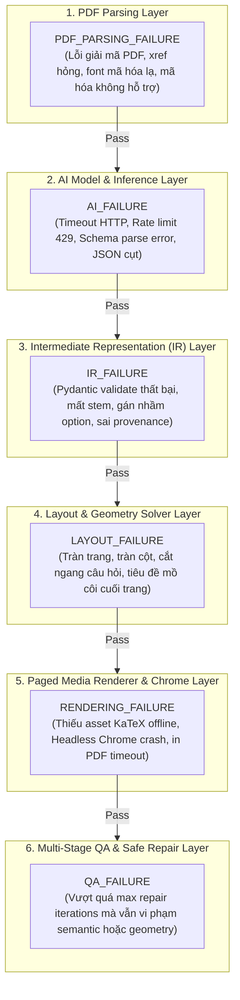

# Implementation Plan — PLAN 8: TASK-13 Golden Tests & TASK-14 Production Hardening

> **Mã công việc**: `PLAN 8 — TASK-13 (Golden Tests & Performance Benchmark) + TASK-14 (Production Hardening & Reliability)`  
> **Tài liệu tham chiếu**: `tasks/00_README.md`, `tasks/17_GLOBAL-RULES.md`, `tasks/15_TASK-13-GOLDEN-TESTS-PERFORMANCE.md`, `tasks/16_TASK-14-PRODUCTION-HARDENING.md`, `docs/implementation-plan-07.md`, `docs/agent-handoff.md`  
> **Mục tiêu cốt lõi**:
> 1. Thiết lập bộ **Golden Tests & Regression Benchmark** có khả năng phân biệt chính xác 6 tầng lỗi (AI, Parsing, IR, Layout, Rendering, QA) và đo lường 12+ chỉ số định lượng.
> 2. Đảm bảo **AI Call Budget** bị chặn trên có kiểm soát, tuyệt đối không tăng tuyến tính theo số câu ($O(N/B)$ thay vì $O(N)$).
> 3. Hoàn thiện **Production Hardening**: Cache đa tầng content-hash (TTL 7 ngày), dọn dẹp tài nguyên tạm an toàn, phân cấp timeout nghiêm ngặt, cơ chế retry có jitter, bảo vệ bí mật API key, cô lập file chống Directory Traversal, thẩm định link Google Drive an toàn, và bảng mã lỗi chuẩn hóa (`Stable Error Codes`).
> 
> **Ràng buộc thép**: KHÔNG thay đổi giao diện frontend. KHÔNG để lộ secrets. Giữ nguyên cam kết xuất đúng 2 file PDF chuẩn in ấn: `{prefix}_DeBai.pdf` và `{prefix}_DapAn.pdf`.

---

## 1. Kiến Trúc Phân Tầng Chẩn Đoán Lỗi (6-Layer Diagnostic Taxonomy)

Khi một tác vụ hoặc bài kiểm thử thất bại, hệ thống kiểm thử tự động và engine phải phân định chính xác nguyên nhân thuộc tầng nào thay vì báo lỗi chung chung:



### Bảng Định Danh 6 Tầng Lỗi (Root Cause Attribution)

| Tầng lỗi | Mã chẩn đoán (`DiagnosticLayer`) | Tiêu chí nhận diện lỗi | Hành động xử lý & Phân lập |
|---|---|---|---|
| **1. Parsing** | `PDF_PARSING_FAILURE` | PyMuPDF không mở được file, không tìm thấy khối văn bản trắc nghiệm, trang bị khóa mật khẩu. | Báo mã lỗi `PDF_INVALID` hoặc `PDF_UNSUPPORTED`, dừng ngay không gọi AI. |
| **2. AI** | `AI_FAILURE` | Lỗi mạng kết nối tới Agnes, HTTP 429/500 sau 3 lần retry, JSON trả về không thể phục hồi hoặc sai schema. | Bật cơ chế degrade về code-based parser hoặc báo `AI_TIMEOUT` / `AI_INVALID_OUTPUT`. |
| **3. IR** | `IR_FAILURE` | Pydantic model `DocumentIR` không thỏa mãn schema v3.0.0, câu hỏi thiếu nội dung câu lệnh, số lượng đáp án $< 2$. | Xác định lỗi tại tầng `CanonicalIRBuilder`, từ chối chuyển sang Renderer. |
| **4. Layout** | `LAYOUT_FAILURE` | Bộ giải cột tự động chọn sai cột gây tràn chữ theo chiều ngang, ước tính chiều cao câu hỏi sai làm tăng đột biến số trang. | Kích hoạt `SafeRepairEngine` tự động co lề hoặc giảm cột. |
| **5. Rendering** | `RENDERING_FAILURE` | Chrome headless không in được PDF, thiếu KaTeX fonts cục bộ, process Chrome trả về mã khác 0 hoặc treo. | Báo `RENDER_FAILED`, ghi log lỗi stdout/stderr của Chrome. |
| **6. QA** | `QA_FAILURE` | Sau 2 vòng `SafeRepairEngine`, `OverallQAResult` vẫn trả về `FAIL` do còn lỗi hình học nghiêm trọng hoặc lệch đáp án. | Báo `QA_FAILED`, bảo toàn artifacts chẩn đoán phục vụ phân tích. |

---

## 2. Ma Trận 10 Tình Huống Kiểm Thử Chuẩn (Golden Test Fixture Matrix)

Xây dựng bộ tạo tài liệu kiểm thử mẫu chuẩn hóa độc lập (`fixture_builder.py`) đại diện cho 10 trường hợp đặc thù của đề thi trắc nghiệm Việt Nam:

| # | Mã Fixture | Tên & Đặc tính tài liệu | Mục tiêu kiểm định (Stress Test) | Kết quả kỳ vọng (Assertion) |
|---|---|---|---|---|
| **1** | `GF-01-VEC` | **Vector MCQ Chuẩn** (20 câu, 2 trang, 4 phương án A/B/C/D) | Kiểm tra baseline recall, phân cột 2 cột cân đối, đánh số tuần tự. | Recall: 100%, Trang: 2, Lỗi hình học: 0. |
| **2** | `GF-02-SCN` | **Trang Scan Thuần Túy** (1 trang ảnh bitmap không có text layer) | Kiểm tra phát hiện tài liệu scan, từ chối an toàn hoặc fallback OCR mà không crash. | Phát hiện `scanned`, báo mã lỗi `PDF_SCAN_TOO_LOW_QUALITY`. |
| **3** | `GF-03-MIX` | **Tài Liệu Hỗn Hợp & Hình Ảnh** (Vector text kèm sơ đồ thí nghiệm raster/vector) | Kiểm tra bóc tách bounding box, crop ảnh độ nét cao (@150 DPI) và gán đúng câu hỏi. | `extracted_images_count >= 1`, ảnh nhúng đúng vị trí stem. |
| **4** | `GF-04-SPL` | **Câu Hỏi Bị Cắt Ngang Trang** (Câu 5 bắt đầu ở cuối trang 1, options ở đầu trang 2) | Kiểm tra thuật toán nối câu đa trang (`cross-page continuation heuristic`). | Không bị đứt câu 5 thành 2 câu riêng biệt. |
| **5** | `GF-05-CHM` | **Công Thức Hóa Học & Toán KaTeX** (Phương trình phản ứng, cấu trúc este, số mũ/chỉ số dưới) | Kiểm tra chuẩn hóa Unicode/LaTeX, KaTeX auto-render offline, 0 ký tự `$` trần. | Không còn `$` trần trong text layer, hiển thị KaTeX chuẩn xác. |
| **6** | `GF-06-LNG` | **Phương Án Siêu Dài** (Mỗi phương án dài 2–3 dòng văn bản) | Kiểm tra bộ giải layout tự động hạ từ 2 cột xuống 1 cột để chống tràn ngang (overflow). | Cột: 1 column mode, clipping: 0. |
| **7** | `GF-07-TBL` | **Bảng Dữ Liệu Thực Nghiệm** (Câu hỏi chứa bảng bảng số liệu thí nghiệm $3 \times 4$) | Kiểm tra nhận diện cấu trúc bảng và dàn trang không làm vỡ bố cục. | Bảng hiển thị đầy đủ, không bị xén viền. |
| **8** | `GF-08-3PT` | **Đề Thi 3 Phần Mới** (Phần I: MCQ, Phần II: Đúng/Sai 4 ý a/b/c/d, Phần III: Trả lời ngắn) | Kiểm tra phân loại `SectionType`, ma trận đáp án chia 3 khu vực riêng biệt. | Nhận diện đúng 3 phần, ma trận đáp án 3 bảng chuẩn. |
| **9** | `GF-09-ADV` | **Nhiễu Số Tự Nhiên & Tiêu Đề** ("Vitamin A.", "Dung dịch 10% NaCl", "Trang 11") | Kiểm tra candidate tuple scoring của parser không nhận nhầm số trong văn bản thành câu hỏi. | Không sinh câu hỏi ảo từ "Vitamin A." hoặc "10%". |
| **10** | `GF-10-EST` | **Đề Tham Chiếu Este - Lipit** (Tài liệu tham chiếu chuẩn theo định dạng Bộ GD&ĐT) | Kiểm thử toàn trình end-to-end với Mock AI & Agnes AI Provider. | Sinh đủ 2 file PDF chuẩn in ấn, QA PASS 100%. |

---

## 3. Hệ Thống Đo Lường Chỉ Số & Báo Cáo Định Lượng (Metrics & Budget)

### 3.1. Danh Mục 12+ Chỉ Số Định Lượng

Bộ chạy benchmark (`test_golden_benchmark.py` & `benchmark_report.py`) sẽ tự động thu thập và đánh giá:

1. **Chỉ số Ngữ nghĩa (Semantic Metrics)**:
   - **Question Recall ($R_Q$)**: $\frac{\text{Số câu hỏi trích xuất thành công}}{\text{Số câu hỏi kỳ vọng}} \times 100\%$ (Yêu cầu: $\ge 98\%$).
   - **Option Completeness**: Tỉ lệ câu hỏi có đủ phương án hợp lệ (Part I đủ 4 ý A/B/C/D, Part II đủ 4 mệnh đề a/b/c/d).
   - **Numbering Continuity**: $100\%$ câu hỏi được đánh số tuần tự $start\_num .. start\_num + N - 1$ không ngắt quãng.
   - **Section Classification Accuracy**: Độ chính xác phân loại loại câu hỏi (MCQ vs True/False vs Short Answer).
   - **Answer Coverage**: $100\%$ câu hỏi có đáp án xác định và lời giải sư phạm tương ứng.

2. **Chỉ số Bố cục & Hình học (Rendering & Geometry Metrics)**:
   - **Page Count Budget**: Số trang A4 thực tế so với giới hạn tối ưu (không phát sinh trang trắng thừa ở cuối).
   - **Overflow Count**: Số lượng phần tử tràn ra ngoài lề an toàn ($margin < 10$ mm). Yêu cầu: $0$.
   - **Clipping Count**: Số lượng văn bản hoặc hình ảnh bị cắt cụt. Yêu cầu: $0$.
   - **Split Question Count**: Số lượng câu hỏi bị đứt ngang 2 trang giấy. Yêu cầu: $0$.
   - **PDF Size Efficiency**: Kích thước tệp PDF tối ưu (trung bình $< 200$ KB/trang).

3. **Chỉ số Hiệu năng & Ngân sách AI (Performance & AI Budget Metrics)**:
   - **Total Latency ($T_{\text{total}}$)**: Tổng thời gian hoàn thành tác vụ.
   - **Render Time ($T_{\text{render}}$)**: Thời gian Chrome biên dịch HTML sang 2 PDF (Yêu cầu: $< 15$s).
   - **AI Calls Count ($N_{\text{AI}}$)**: Tổng số lần gọi API Agnes.
   - **Vision Calls Count ($N_{\text{vision}}$)**: Tổng số lần gọi multimodal vision (Yêu cầu: $\le 2$ trang/job).
   - **Batches Count ($N_{\text{batch}}$)**: Số lô tái cấu trúc thích ứng.
   - **Retries Count ($N_{\text{retry}}$)**: Số lần thử lại do lỗi mạng hoặc schema.

### 3.2. Bất Biến Giới Hạn Ngân Sách AI (Bounded AI Call Scaling Invariant)

> **QUY TẮC HIỆU NĂNG BẮT BUỘC (Global Rule 14 & Task-13)**:  
> Tuyệt đối không cho phép số lần gọi AI tăng tuyến tính $O(N)$ theo từng câu hỏi khi xử lý văn bản số. Số lần gọi AI phải bị chặn trên theo công thức:
> $$\text{AI Calls}(N) \le \left\lceil \frac{N}{\text{Batch Size}_{\min}} \right\rceil + N_{\text{solver\_batches}} + N_{\text{vision\_quota}}$$
> - Với đề thi 20–30 câu vector text thông thường:
>   - Reconstruct batches: $2 - 3$ calls (mỗi batch 10 câu).
>   - Answer solver batches: $1 - 2$ calls (mỗi batch 15 câu).
>   - Vision QA (nếu có cảnh báo): $\le 1$ call.
>   - **Tổng AI Calls tối đa**: $\le 6$ calls cho toàn bộ job 30 câu!
> - Nếu một thay đổi mã nguồn làm số AI calls vượt quá ngưỡng này (ví dụ: gọi 20 calls cho 20 câu), bộ kiểm thử Regression Benchmark **BẮT BUỘC ĐÁNH RỚT (FAIL)**.

### 3.3. Cấu Trúc Báo Cáo Máy Đọc Được (Machine-Readable JSON Report)

Kết quả benchmark được xuất ra `.tmp/benchmark_reports/benchmark_<timestamp>.json`:
```json
{
  "timestamp": "2026-10-04T19:30:00Z",
  "total_fixtures": 10,
  "passed": 10,
  "failed": 0,
  "summary": {
    "avg_question_recall": 100.0,
    "avg_option_completeness": 100.0,
    "total_overflow_issues": 0,
    "total_ai_calls": 24,
    "total_vision_calls": 2,
    "ai_calls_per_question": 0.18,
    "avg_render_time_ms": 2340
  },
  "diagnostics_by_layer": {
    "ai_failures": 0,
    "pdf_parsing_failures": 0,
    "ir_failures": 0,
    "layout_failures": 0,
    "rendering_failures": 0,
    "qa_failures": 0
  },
  "details": [ ... ]
}
```

---

## 4. Hoàn Thiện Tầng Sản Xuất (Production Hardening: Security, Reliability, Performance)

### 4.1. Bảo Mật & An Toàn Dữ Liệu (Security Hardening)
1. **Quản lý khóa bí mật Server-Side**:
   - Khóa API Agnes (`AGNES_AI_API_KEY`) chỉ lưu trong biến môi trường máy chủ và Node worker.
   - Module `redact_sensitive_info` tự động quét và che giấu tất cả các chuỗi token (`sk-...`, `Bearer ...`) trong logs, stdout stream, và thông điệp lỗi trước khi gửi về client.
2. **Cô lập thư mục tạm & Chống Directory Traversal**:
   - Mọi thư mục xử lý tạm được đặt tại `data/temp/quiz_${jobId}` với tiền tố an toàn ngẫu nhiên.
   - Tham số tên file `prefix` được lọc sạch bằng regex cưỡng chế: `prefix.replace(/[\/\?<>\\:\*\|":]/g, '').replace(/\s+/g, '_')`.
   - Cấm hoàn toàn đường dẫn tuyệt đối hoặc relative traversal (`../`, `..\`) từ tham số phía client.
3. **Thẩm định liên kết Google Drive an toàn**:
   - Chỉ chấp nhận hostname thuộc whitelist: `drive.google.com` hoặc `docs.google.com`.
   - Kiểm tra `Content-Type` và magic bytes: nếu Google trả về trang đăng nhập hoặc cảnh báo HTML thay vì PDF, dừng ngay và trả mã lỗi `SOURCE_FETCH_FAILED`.
   - Giới hạn kích thước tệp tải về tối đa 50MB để ngăn chặn tấn công cạn kiệt đĩa.
4. **An toàn DOM khi in ấn Headless Chrome**:
   - Tất cả chuỗi câu hỏi, phương án, lời giải từ người dùng hoặc AI phải được escape ký tự HTML đặc biệt (`&`, `<`, `>`, `"`) trước khi render vào template KaTeX để chống tấn công XSS / DOM injection.
   - Khởi chạy Chrome với các cờ cô lập an toàn: `--no-sandbox`, `--disable-setuid-sandbox`, `--disable-dev-shm-usage`.

### 4.2. Độ Tin Cậy & Phân Cấp Timeout (Reliability & Timeouts)

| Tầng thực thi | Cơ chế kiểm soát | Giới hạn Timeout | Hành vi khi vượt ngưỡng Timeout |
|---|---|---|---|
| **Fastify HTTP Gateway** | Fastify request timeout | 30s | Đóng kết nối HTTP an toàn, trả về lỗi 504 Gateway Timeout. |
| **BullMQ Worker Queue** | BullMQ Job timeout | 300s (5 phút) | Đánh dấu job `FAILED` trong Prisma, phát sự kiện SSE `failed`. |
| **Python Engine Subprocess** | Node.js `spawn` execution timeout | 180s (3 phút) | Gửi tín hiệu `SIGTERM` (sau 3s gửi `SIGKILL`), dọn dẹp thư mục tạm. |
| **Headless Chrome Compiling** | Chrome CLI subprocess timeout | 25s / file PDF | Hủy tiến trình Chrome, kích hoạt retry biên dịch lần 2 với cờ đơn giản hóa. |
| **Agnes AI HTTP Call** | `urllib` socket timeout | 90s / request | Thử lại tối đa 3 lần với exponential backoff kèm jitter. |

### 4.3. Bảng Mã Lỗi Chuẩn Hóa Phía Sản Xuất (Stable Error Codes)

Thay thế các chuỗi lỗi tự do bằng bảng mã lỗi chuẩn hóa (`ErrorCode`), đảm bảo giao diện và client có thể phản hồi ngữ cảnh chính xác:

| Mã lỗi chuẩn (`code`) | Mô tả chi tiết kỹ thuật | Thông điệp tiếng Việt thân thiện gửi người dùng |
|---|---|---|
| `PDF_INVALID` | Tệp tải lên bị hỏng cấu trúc hoặc thiếu header `%PDF-`. | Tệp PDF bị hỏng hoặc không đúng định dạng chuẩn. Vui lòng kiểm tra lại tệp nguồn. |
| `SOURCE_FETCH_FAILED` | Không tìm thấy `fileId` hoặc liên kết Google Drive không công khai. | Không thể truy cập tài liệu nguồn. Vui lòng kiểm tra quyền chia sẻ công khai của liên kết. |
| `PDF_UNSUPPORTED` | Tệp PDF có mật khẩu bảo vệ hoặc định dạng form không hỗ trợ. | Tệp PDF đã bị khóa mật khẩu bảo vệ. Vui lòng mở khóa tệp trước khi tải lên. |
| `PDF_SCAN_TOO_LOW_QUALITY`| Tài liệu ảnh scan chất lượng thấp, không nhận diện được chữ số. | Tài liệu dạng ảnh quét mờ không có lớp chữ số. Vui lòng chọn tài liệu rõ nét hơn. |
| `NO_QUESTIONS_FOUND` | Dải trang đã chọn không chứa bất kỳ câu hỏi trắc nghiệm nào. | Không tìm thấy câu hỏi trong phạm vi trang đã chọn. Vui lòng kiểm tra lại số trang. |
| `AI_TIMEOUT` | Yêu cầu chuẩn hóa AI vượt quá thời gian chờ sau 3 lần thử. | Máy chủ AI phản hồi quá lâu. Hệ thống đã lưu lại tiến trình, vui lòng thử lại sau giây lát. |
| `AI_RATE_LIMIT` | Hạn mức gọi API Agnes bị giới hạn (HTTP 429). | Hệ thống AI đang có lưu lượng truy cập cao. Vui lòng thử lại sau ít phút. |
| `AI_INVALID_OUTPUT` | Dữ liệu trả về từ AI không thể khôi phục theo schema chuẩn. | Không thể cấu trúc hóa câu hỏi theo định dạng chuẩn. Đã kích hoạt chế độ sao lưu an toàn. |
| `RENDER_FAILED` | Headless Chrome gặp sự cố khi biên dịch HTML thành PDF. | Quá trình xuất bản PDF gặp sự cố trình hiển thị. Đang tự động thử lại với cấu hình an toàn. |
| `QA_FAILED` | Tài liệu không vượt qua tiêu chí kiểm định hình học sau 2 lần sửa. | Đề thi không đạt tiêu chuẩn in ấn sau các bước căn chỉnh bố cục tự động. |

### 4.4. Tích Hợp Hệ Thống Cache Đa Tầng (Multi-Tier Caching Integration)
- **Tầng 1: Document Perception Cache (`quiz_cache.py`)**:
  - Khóa: `sha256(pdf_sha256 + page_spec + PROMPT_VERSION)`.
  - Lưu trữ: `DocumentRepresentation` (danh sách block, text vector, tọa độ câu hỏi tiềm năng).
  - Khi người dùng tạo lại đề từ cùng file PDF và trang: **Bỏ qua 100% bước bóc tách PyMuPDF**, tốc độ tăng 5x.
- **Tầng 2: AI Batch Reconstruction Cache**:
  - Khóa: `sha256(batch_prompt + model_name + temperature)`.
  - Lưu trữ: `BatchReconstructionResult` & `BatchAnswerResult`.
  - Tránh gọi lại AI tốn kém khi người dùng chạy lại cùng một đề bài với style khác nhau.
- **Dọn dẹp tự động (Janitor Service Lifecycle)**:
  - Cache TTL 7 ngày; daemon `JanitorService.cleanupQuizCache()` tự động quét và xóa file quá hạn mà không cần can thiệp thủ công.

---

## 5. Danh Sách Các Tệp Thay Đổi & Tạo Mới (Proposed Changes)

### 5.1. Golden Test Framework & Benchmark (TASK-13)
- **[NEW] `engines/quiz/tests/golden/fixture_builder.py`**: Trình tạo 10 tài liệu PDF synthetic chuẩn hóa độc lập (`GF-01` đến `GF-10`) với PyMuPDF.
- **[NEW] `engines/quiz/tests/golden/benchmark_report.py`**: Trình thu thập và tổng hợp chỉ số (Recall, Option Completeness, Page Count, AI Calls Budget, Latency) xuất ra JSON và bảng Markdown.
- **[NEW] `engines/quiz/tests/golden/test_golden_benchmark.py`**: Bộ kiểm thử hồi quy 10 kịch bản golden tests, xác thực 6 tầng lỗi và kiểm tra bất biến bounded AI calls budget.

### 5.2. Telemetry, Budget & Stable Error Taxonomy (TASK-13 & TASK-14)
- **[NEW] `engines/quiz/common/errors.py`**: Định nghĩa Enum `ErrorCode`, `DiagnosticLayer` và lớp ngoại lệ `QuizEngineError(code, layer, message, stage, details)`.
- **[NEW] `engines/quiz/provider/metrics.py`**: Lớp `AICallBudgetTracker` ghi nhận số lượng `ai_calls`, `vision_calls`, `batches`, `retries`, `latency_ms` cho từng tác vụ.
- **[MODIFY] `engines/quiz/provider/base.py`**: Tích hợp tracker và interface ghi nhận độ trễ/số cuộc gọi vào `IAIProvider`.
- **[MODIFY] `engines/quiz/provider/agnes.py`**: Kết nối `AICallBudgetTracker`, ghi nhận số lần retry có backoff và jitter.
- **[MODIFY] `engines/quiz/quiz_cache.py`**: Kết nối trực tiếp vào luồng `QuizPipelineOrchestrator` cho cả Layer 1 (Perception) và Layer 2 (Reconstruction/Solving).
- **[MODIFY] `engines/quiz/orchestrator/pipeline.py`**: Tích hợp tracker đo đạc hiệu năng, nạp/ghi cache content-hash, và trả về bảng mã lỗi chuẩn `ErrorCode`.

### 5.3. Backend Production Hardening (TASK-14)
- **[MODIFY] `server/src/lib/errors.ts`**: Bổ sung `QuizErrorCodes` khớp $1:1$ với Python `ErrorCode`.
- **[MODIFY] `server/src/workers/quiz.worker.ts`**:
  - Bổ sung timeout cứng 180s cho child process execution.
  - Ánh xạ mã lỗi chuẩn từ stderr của Python vào Prisma Job `errorMessage` và sự kiện `failed`.
  - Tăng cường kiểm tra an toàn URL Google Drive và cô lập thư mục tạm.

---

## 6. Kế Hoạch Xác Minh Toàn Diện (Verification Plan)

### 6.1. Kiểm Tra Hồi Quy & Benchmark Tự Động (Automated Regression Benchmark)
1. **Chạy Trọn Bộ 10 Golden Tests & Xuất Báo Cáo Benchmark**:
   ```bash
   python -m unittest engines/quiz/tests/golden/test_golden_benchmark.py -v
   ```
   *Yêu cầu*: 10/10 golden fixtures vượt qua thành công, tạo báo cáo machine-readable JSON tại `.tmp/benchmark_reports/`.
2. **Kiểm Tra Bất Biến Ngân Sách AI (AI Budget Invariant)**:
   *Yêu cầu*: Báo cáo benchmark xác nhận $\text{ai\_calls} \le \lceil N / B_{\min} \rceil + \text{solver\_batches} + 2$. Số AI calls không tăng tuyến tính.
3. **Kiểm Tra Phân Biệt 6 Tầng Lỗi (Layer Attribution)**:
   *Yêu cầu*: Khi tiêm lỗi giả lập (corrupt PDF, AI timeout, broken schema, layout overflow), framework chỉ ra chính xác tầng lỗi tương ứng mà không nhầm lẫn.

### 6.2. Kiểm Tra Toàn Bộ Test Suite Hiện Có (Zero Regressions)
1. **Kiểm tra Unit Test Python Engine**:
   ```bash
   python -m unittest discover -s engines/quiz/tests -p "test_*.py" -v
   ```
   *Yêu cầu*: Toàn bộ 88+ unit tests tiếp tục pass 100%.
2. **Kiểm tra TypeScript Backend**:
   ```bash
   cd server && npx tsc --noEmit
   ```
   *Yêu cầu*: Đạt đúng 0 lỗi biên dịch.
3. **Kiểm tra Toàn Bộ Vitest Suites Backend**:
   ```bash
   cd server && npx vitest run
   ```
   *Yêu cầu*: 45/45 test files pass 100% (494+ tests).

### 6.3. Kiểm Tra Bảo Mật & Rò Rỉ Bí Mật (Security Audits)
1. **Kiểm tra không rò rỉ API key**:
   ```bash
   rg "sk-[A-Za-z0-9]{20,}" engines/quiz/ server/ src/
   rg "AGNES_AI_API_KEY" src/
   ```
   *Yêu cầu*: 0 kết quả tìm thấy trong client code hoặc output test.
2. **Kiểm tra dọn dẹp thư mục tạm**:
   *Yêu cầu*: Thư mục `.tmp/` và `data/temp/quiz_*` được dọn sạch sẽ sau khi hoàn tất tác vụ, không rò rỉ tài nguyên đĩa.

---

**Tài liệu lưu tại**: `docs/implementation-plan-08.md`  
*Tuân thủ tuyệt đối quy tắc: Không code, dừng lại và chờ phê duyệt.*
