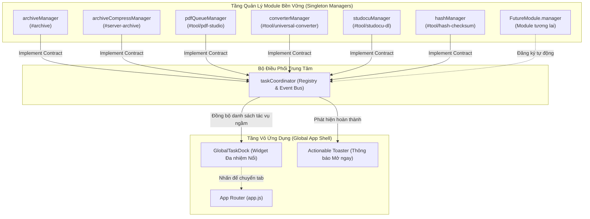

# [KI-CON-003] Kiến Trúc Đa Nhiệm Độc Lập Toàn Diện & Mở Rộng Tương Lai (Universal Extensible Multitasking Architecture)

## 1. Context & Purpose
Trong một ứng dụng Single Page Application (SPA) truyền thống, trạng thái và tác vụ của từng màn hình thường bị gắn chặt vào vòng đời của DOM (DOM mount / unmount). Khi người dùng khởi chạy một tác vụ tốn thời gian (ví dụ: tải lên tệp nén 500MB, chuyển đổi lô 20 ảnh/video, ghép tài liệu PDF, hoặc cào tài liệu Studocu 100 trang) rồi chuyển sang module khác để làm việc, toàn bộ tác vụ đang dở dang thường bị hủy bỏ đột ngột do hàm teardown của router dọn dẹp biến cục bộ.

**DuyDev Studio (DS)** khắc phục triệt để vấn đề này bằng mô hình **Đa nhiệm Độc lập Toàn diện (Universal Independent Multitasking)**:
- **Tách rời 100% vòng đời tác vụ (Task Lifecycle) khỏi vòng đời giao diện (DOM Lifecycle)**: Tác vụ chạy trong bộ nhớ của các Singleton Manager bền vững.
- **Sổ bộ Tác vụ Toàn cục (`taskCoordinator`)**: Tập trung giám sát mọi tiến trình ngầm, tổng hợp tiến độ thời gian thực, điều phối thông báo và hỗ trợ hủy tác vụ.
- **Giao diện Thanh Tác Vụ Nổi (`GlobalTaskDock`)**: Widget nổi thông minh theo phong cách tối giản Linear/Vercel, tự động xuất hiện khi có tác vụ chạy ngầm và cho phép nhảy tức thì về trang tương ứng bằng 1 cú click.
- **Khả năng Mở rộng Tương lai (Future-Proof Open-Closed Contract)**: Bất kỳ module mới nào chỉ cần tuân thủ giao thức `IModuleTaskManager` là tự động kích hoạt đa nhiệm ngầm mà không phải chỉnh sửa router lõi.

---

## 2. System Architecture



---

## 3. The Future Module Contract (`IModuleTaskManager`)

Mọi module hiện tại và tương lai tích hợp vào DuyDev Studio phải tuân thủ chuẩn giao thức sau:

```javascript
/**
 * @typedef {Object} ActiveTask
 * @property {string} id Mã định danh duy nhất của tác vụ (ví dụ: 'pdf-job-123')
 * @property {string} moduleId Mã module ('archive', 'pdf-studio', 'ocr-studio')
 * @property {string} moduleTitle Tên hiển thị của module ('PDF Studio', 'OCR Studio')
 * @property {string} title Tên tệp hoặc mô tả tác vụ ('data.zip', 'Ghép 3 tệp PDF')
 * @property {'running'|'completed'|'error'|'idle'} status Trạng thái xử lý
 * @property {number} progress Tiến độ từ 0 đến 100
 * @property {string} stage Nhãn giai đoạn ('Đang truyền 45% (3.2 MB/s)', 'Đang ghép trang...')
 * @property {string} route Hash route để điều hướng ('#archive', '#tool/ocr-studio')
 * @property {() => void} [cancel] Hàm hủy tác vụ chủ động
 * @property {string} [resultUrl] Đường dẫn tải về hoặc xem kết quả
 */

/**
 * @typedef {Object} IModuleTaskManager
 * @property {string} moduleId
 * @property {string} moduleTitle
 * @property {string} route
 * @property {() => ActiveTask[]} getActiveTasks
 * @property {(listener: (event?: string, data?: any) => void) => (() => void)} subscribe
 * @property {(taskId: string) => void} [cancelTask]
 */
```

---

## 4. How to Create and Register a New Module (Quy trình thêm module mới)

Khi một kỹ sư hoặc agent thêm module mới vào DuyDev Studio (ví dụ: `Audio Transcriber` hoặc `AI Upscaler`):

### Bước 1: Xây dựng Module Manager Singleton
Tạo tệp `src/components/tools/new-tool/hooks/useNewTool.js`:

```javascript
import { taskCoordinator } from '../../../../utilities/taskCoordinator.js';

class NewToolManager {
  constructor() {
    this.moduleId = 'new-tool';
    this.moduleTitle = 'New Tool Studio';
    this.route = '#tool/new-tool';
    this.isProcessing = false;
    this.progress = 0;
    this.stage = '';
    this.currentFile = null;
    this.listeners = new Set();
  }

  subscribe(listener) {
    this.listeners.add(listener);
    return () => this.listeners.delete(listener);
  }

  notify(event) {
    this.listeners.forEach((fn) => fn(event));
  }

  getActiveTasks() {
    if (!this.isProcessing) return [];
    return [
      {
        id: `new-tool-task-${Date.now()}`,
        moduleId: this.moduleId,
        moduleTitle: this.moduleTitle,
        title: this.currentFile?.name || 'Đang xử lý dữ liệu',
        status: 'running',
        progress: this.progress,
        stage: this.stage || 'Đang thực thi...',
        route: this.route,
        cancel: () => this.cancelTask()
      }
    ];
  }

  cancelTask() {
    this.isProcessing = false;
    this.notify('task-canceled');
  }

  async runTask(file) {
    this.isProcessing = true;
    this.currentFile = file;
    this.progress = 10;
    this.stage = 'Bắt đầu...';
    this.notify('task-start');

    // Thực thi xử lý độc lập không phụ thuộc DOM...
  }
}

export const newToolManager = new NewToolManager();
// Đăng ký tự động với Bộ Điều Phối Đa Nhiệm Toàn Cục
taskCoordinator.registerManager(newToolManager);
```

### Bước 2: Tách Rời DOM Teardown trong View Controller
Trong tệp `attachNewToolListeners(rerender)`:
```javascript
export function attachNewToolListeners(rerender) {
  let isMounted = true;

  // Lắng nghe manager cập nhật DOM
  const unsub = newToolManager.subscribe((event) => {
    if (!isMounted) return;
    rerender?.();
  });

  // HÀM DỌN DẸP KHI RỜI ROUTE:
  return () => {
    isMounted = false;
    unsub(); // CHỈ HỦY OBSERVER DOM, TUYỆT ĐỐI KHÔNG HỦY TIẾN TRÌNH TRONG newToolManager!
  };
}
```

### Bước 3: Nghiễm nhiên Hoạt động Đa nhiệm
Không cần chỉnh sửa `GlobalTaskDock.js` hay `app.js`:
1. Khi `newToolManager.isProcessing = true`, `GlobalTaskDock` tự động hiển thị chip tiến trình của `New Tool Studio`.
2. Khi người dùng chuyển tab sang bất kỳ module nào khác, tác vụ tiếp tục chạy ngầm trong bộ nhớ trình duyệt.
3. Khi tác vụ hoàn tất, hệ thống tự động bắn **Actionable Toast** với nút `[Mở ngay]`, bấm vào sẽ điều hướng thẳng về `#tool/new-tool`.

---

## 5. Verification & Testing

1. **Kiểm thử đa nhiệm đồng thời**:
   - Khởi chạy upload 100MB ở `#archive`.
   - Lập tức chuyển sang `#tool/pdf-studio` thực hiện ghép file.
   - Chuyển sang `#tool/universal-converter` đổi định dạng tệp.
   - Rời ra `#dashboard`.
   - Kết quả: `GlobalTaskDock` hiển thị badge `3 tác vụ đang chạy ngầm` với 3 thanh tiến độ cập nhật song song.
2. **Kiểm thử hợp đồng module tương lai**:
   - Đảm bảo bộ test [server/tests/unit/task_coordinator.test.ts](file:///server/tests/unit/task_coordinator.test.ts) luôn đạt 100% passed.

---

## 6. Changelog
- **2026-09-25 (v1.0.0)**: Khởi tạo kiến trúc đa nhiệm độc lập toàn diện và giao thức mở rộng module tương lai (@anhduy).
