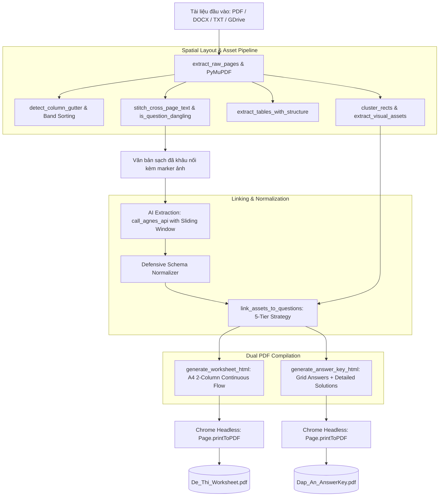

# [KI-CON-004] Kiến Trúc Pipeline Trích Xuất & Biên Soạn Đề Thi Trắc Nghiệm A4 2 Cột Chống Tràn Trang (Quiz Pipeline V2)

## 1. Context & Purpose
Trước phiên bản V2, việc tạo tài liệu trắc nghiệm từ tài liệu PDF/DOCX scan gặp các nhược điểm lớn:
- Đề thi A4 1 cột chiếm quá nhiều diện tích giấy (lãng phí 40-50% không gian trang A4).
- Các câu hỏi chứa hình vẽ, đồ thị, bảng biểu bị mất hoặc bị cắt rời khỏi câu hỏi tương ứng.
- Đề bài và bảng đáp án bị gộp chung vào 1 tệp, gây bất tiện khi in ấn phát đề cho học sinh.
- Các mô hình AI trích xuất JSON thường xuyên gặp lỗi thiếu trường, sai cấu trúc dữ liệu hoặc rách câu hỏi ở ranh giới trang (page boundaries).

**Quiz Pipeline V2** (`engines/quiz/quiz_pipeline.py`) giải quyết trọn vẹn bài toán này bằng kiến trúc xử lý 5 tầng:
1. **Spatial Layout Extraction (PyMuPDF)**: Phân tích tọa độ hình học, nhận diện rãnh cột (gutter), loại bỏ Running Header/Footer và nhận diện bảng biểu có cấu trúc.
2. **Visual Asset Extraction & Clustering**: Cắt tách hình vẽ, đồ thị và cụm vector bằng `pymupdf.Rect` clustering, lưu thành base64 data URI.
3. **Cross-Page Stitching & Defensive Normalization**: Khâu nối câu hỏi bị đứt gãy giữa 2 trang và chuẩn hóa phòng thủ schema JSON từ LLM.
4. **Dual A4 Paged Media Compilation**: Biên soạn song song 2 tệp HTML/CSS Paged Media: **Đề thi (Worksheet)** và **Bảng đáp án chi tiết (Answer Key)**.
5. **Headless Chrome PDF Rendering**: Sử dụng Google Chrome Headless xuất bản tài liệu PDF vector chất lượng in ấn 300 DPI.

---

## 2. Architecture Overview & Data Flow



---

## 3. Core Structural Pillars of Quiz Pipeline V2

### 3.1. Nhận diện rãnh cột & phân đoạn dạng băng (Band-based Layout Sorting)
Tài liệu trắc nghiệm tại Việt Nam thường trộn lẫn phần tiêu đề spanning toàn trang (trường, kỳ thi) với nội dung 2 cột bên dưới, hoặc có các banner phân tách giữa trang.
Hàm `detect_column_gutter` và `sort_blocks_by_layout` áp dụng thuật toán chia băng (band segmentation):
```python
def sort_blocks_by_layout(page: pymupdf.Page, blocks: list = None) -> list:
    """
    Detects 2-column gutter and orders text with band-based segmentation:
    Spanning headers -> [Col 1 (top-to-bottom) then Col 2 (top-to-bottom)] -> Spanning mid-banners -> Footer.
    Eliminates both horizontal interleaving and mid-page banner scrambles.
    """
    x_split = detect_column_gutter(page, filtered_blocks)
    gutter_margin = pw * 0.03
    ...
```

### 3.2. Chiến lược liên kết tài nguyên ảnh 5 cấp (5-Tier Visual Asset Linking)
Đảm bảo 100% hình vẽ, đồ thị thí nghiệm được gắn chính xác vào câu hỏi tương ứng trong `link_assets_to_questions`:
1. **Tier 1 (Explicit Source ID Mapping)**: Khớp trực tiếp số thứ tự câu hỏi thực tế trong tài liệu gốc (`source_question_nums`).
2. **Tier 2 (Layout Spatial Map)**: Khớp tài nguyên ảnh theo thứ tự xuất hiện trên trang trước khi câu hỏi bắt đầu.
3. **Tier 3 (Marker Regex Match)**: Tìm kiếm các marker ẩn `[IMAGE_REF: fig_pX_Y.png]` được nhúng trong thân câu hỏi hoặc 4 phương án A/B/C/D.
4. **Tier 4 (Keyword Proximity Fallback)**: Quét các từ khóa định vị trong tiếng Việt (*"hình vẽ", "hình bên", "hình dưới", "đồ thị", "thí nghiệm", "phổ", "sơ đồ", "cấu tạo"*).
5. **Tier 5 (Clean Sanitation)**: Xóa sạch toàn bộ marker kỹ thuật thô trước khi đưa vào template HTML hiển thị.

### 3.3. Dàn trang A4 2 cột dòng chảy liên tục (Continuous Flow Paged Media)
Sử dụng CSS Paged Media `@page` và `column-count: 2`:
```css
@page {
    size: A4 portrait;
    margin: 14mm 12mm 14mm 12mm;
    @bottom-right {
        content: "Trang " counter(page) " / " counter(pages);
        font-family: 'Geist', sans-serif;
        font-size: 8pt;
        color: #71717A;
    }
}

.worksheet-body {
    column-count: 2;
    column-gap: 8mm;
    column-rule: 0.5pt solid #E4E4E7;
}

.question-block {
    break-inside: avoid;
    page-break-inside: avoid;
    margin-bottom: 3.5mm;
}
```
> [!IMPORTANT]
> **Tuyệt đối cấm ngắt trang nhân tạo (`page-break-before: always`) giữa các câu hỏi**. Bố cục 2 cột phải chảy tự nhiên, chỉ dùng `break-inside: avoid` trên từng khối `.question-block` để câu hỏi không bị xé đôi giữa 2 cột hoặc giữa 2 trang.

---

## 4. Dual Result Cards & Worker Contract

Tại tầng điều phối Backend (`server/src/workers/quiz.worker.ts`), hệ thống sinh và phát hành 2 tệp độc lập:
1. `worksheetFileId`: Tệp đề thi (không có gạch chân đáp án hay lời giải).
2. `answerKeyFileId`: Tệp đáp án (bảng ma trận trắc nghiệm cô đọng + phần lời giải chi tiết từng câu).

Sự kiện hoàn tất được phát qua BullMQ / SSE:
```json
{
  "event": "completed",
  "data": {
    "jobId": "job_quiz_01HQK8...",
    "percentage": 100,
    "worksheetFileId": "fil_ws_01HQK8...",
    "answerKeyFileId": "fil_ak_01HQK8...",
    "worksheetFileName": "De_Thi_Toan_12_Worksheet.pdf",
    "answerKeyFileName": "De_Thi_Toan_12_AnswerKey.pdf",
    "totalQuestions": 40,
    "sourcePages": 6
  }
}
```

---

## 5. Verification & Testing Standards

1. **Unit Test Coverage**: `engines/quiz/test_quiz_pipeline_v2.py`
   - `test_no_artificial_page_breaks_in_worksheet_and_answer_key`: Xác nhận không có khoảng trắng nhân tạo giữa các câu hỏi.
   - `test_link_assets_to_questions_with_source_nums`: Kiểm tra liên kết hình ảnh theo thứ tự đề gốc.
   - `test_stitch_cross_page_text`: Xác nhận câu hỏi rách qua trang nối lại hoàn chỉnh.
2. **Backend Contract Test**: `server/tests/unit/quiz.test.ts`
   - Kiểm tra schema validation Zod (`quiz.schema.ts`).
   - Kiểm tra phát hành tệp kép và quản lý lịch sử lưu trữ.

---

## 6. Changelog
- **2026-10-02 (v1.0.0)**: Khởi tạo KI-CON-004 ghi nhận toàn bộ cấu trúc và cải tiến của Quiz Pipeline V2 sau chuỗi 10 commit tối ưu hóa.
