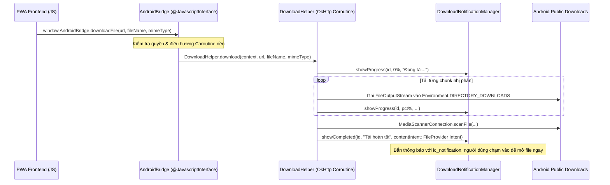

# [KI-FIX-018] Tích Hợp Android Native Bridge Xử Lý Download File Nền & Bắn Push Notification Kèm App Icon Trong PWA WebView

## 1. Context & Triệu Chứng (Symptom & Root Cause)

Khi ứng dụng DuyDev Studio được đóng gói hoặc chạy trong ứng dụng Android Native (sử dụng `WebView` hoặc Trusted Web Activity):
1. **Lỗi thẻ `<a download>` bị vô hiệu hóa**: Android WebView theo mặc định không có bộ xử lý download tự động. Khi người dùng bấm "Tải đề thi PDF" hoặc "Cập nhật APK", WebView không kích hoạt tải về hoặc âm thầm nuốt sự kiện.
2. **Tiến trình tải bị hủy khi chuyển ứng dụng**: Nếu tải file bằng `fetch()` trong JavaScript, khi người dùng chuyển sang app khác, hệ điều hành Android sẽ đóng băng (freeze) tiến trình WebView, dẫn đến đứt gãy file tải về.
3. **Thiếu thông báo hệ thống (Notification Tray)**: Người dùng không biết file đã tải xong ở đâu, không có thông báo kèm icon app trên khay hệ thống để mở nhanh.

---

## 2. Giải Pháp Triệt Để (Resolution)

Thiết lập cơ chế cầu nối 2 chiều giữa **PWA JavaScript** và **Android Native Kotlin**:



### 2.1. Cầu nối JavaScript Interface (`AndroidBridge.kt`)
Đăng ký Interface với WebView trong `MainActivity.kt`:
```kotlin
webView.addJavascriptInterface(AndroidBridge(this), "AndroidBridge")
```

Hàm native xử lý tải file trong `AndroidBridge.kt`:
```kotlin
@JavascriptInterface
fun downloadFile(url: String, fileName: String, mimeType: String) {
    activity.runOnUiThread {
        DownloadHelper.download(
            context = activity,
            url = url,
            suggestedFileName = fileName,
            mimeType = mimeType,
            userAgent = activity.binding.webView.settings.userAgentString
        )
    }
}
```

### 2.2. Trình tải file nền đa luồng (`DownloadHelper.kt`)
Sử dụng `OkHttpClient` với Coroutine `Dispatchers.IO`, ghi thẳng vào thư mục `Environment.DIRECTORY_DOWNLOADS`:
```kotlin
object DownloadHelper {
    private val client = OkHttpClient.Builder()
        .connectTimeout(30, TimeUnit.SECONDS)
        .readTimeout(60, TimeUnit.SECONDS)
        .followRedirects(true)
        .build()

    fun download(context: Context, url: String, suggestedFileName: String, mimeType: String, userAgent: String?) {
        CoroutineScope(Dispatchers.IO).launch {
            val downloadId = System.currentTimeMillis().toInt()
            val destFile = File(Environment.getExternalStoragePublicDirectory(Environment.DIRECTORY_DOWNLOADS), suggestedFileName)
            
            // Bắn notification khởi đầu kèm ic_notification
            DownloadNotificationManager.showProgress(context, downloadId, suggestedFileName, 0)
            
            val request = Request.Builder().url(url).apply {
                if (!userAgent.isNullOrBlank()) header("User-Agent", userAgent)
            }.build()

            client.newCall(request).execute().use { response ->
                val body = response.body ?: throw IOException("Empty response")
                val totalBytes = body.contentLength()
                var downloadedBytes = 0L

                body.byteStream().use { input ->
                    FileOutputStream(destFile).use { output ->
                        val buffer = ByteArray(8 * 1024)
                        var bytesRead: Int
                        while (input.read(buffer).also { bytesRead = it } != -1) {
                            output.write(buffer, 0, bytesRead)
                            downloadedBytes += bytesRead
                            if (totalBytes > 0) {
                                val progress = ((downloadedBytes * 100) / totalBytes).toInt()
                                DownloadNotificationManager.showProgress(context, downloadId, suggestedFileName, progress)
                            }
                        }
                    }
                }
            }

            // Quét media scanner để file xuất hiện ngay trong app Tệp
            MediaScannerConnection.scanFile(context, arrayOf(destFile.absolutePath), arrayOf(mimeType), null)
            DownloadNotificationManager.showCompleted(context, downloadId, suggestedFileName, destFile, mimeType)
        }
    }
}
```

### 2.3. Fallback mượt mà trên PWA Web (`src/components/tools/quiz/utilities/quizHistoryHelper.js`)
Phía client-side kiểm tra sự tồn tại của `window.AndroidBridge`:
```javascript
export function triggerFileDownload(downloadUrl, fileName, mimeType = 'application/pdf') {
  // 1. Nếu đang chạy trong Android App Native -> Gọi Native Bridge
  if (window.AndroidBridge && typeof window.AndroidBridge.downloadFile === 'function') {
    const fullUrl = new URL(downloadUrl, window.location.origin).href;
    window.AndroidBridge.downloadFile(fullUrl, fileName, mimeType);
    return;
  }

  // 2. Nếu đang chạy trên Trình duyệt thông thường -> Dùng thẻ <a> ẩn
  const link = document.createElement('a');
  link.href = downloadUrl;
  link.setAttribute('download', fileName);
  document.body.appendChild(link);
  link.click();
  document.body.removeChild(link);
}
```

---

## 3. Gotchas & Edge Cases

> [!WARNING]
> 1. **Android 13+ (API 33) Notification Permission**: Từ Android 13 trở lên, phải xin quyền `android.permission.POST_NOTIFICATIONS` ở runtime. Nếu người dùng chưa cấp, `DownloadNotificationManager` phải try-catch `SecurityException` để tránh crash app.
> 2. **FileProvider và quyền mở file ngoài**: Khi người dùng nhấn vào notification để mở file PDF, Intent mở file bắt buộc dùng `FileProvider.getUriForFile(...)` kèm cờ `FLAG_GRANT_READ_URI_PERMISSION`. Cấm truyền thẳng `Uri.fromFile(destFile)` vì sẽ ném ngoại lệ `FileUriExposedException`.
> 3. **Tên file tải về (APK / PDF)**: Luôn chuẩn hóa đuôi mở rộng `.pdf` hoặc `.apk`. Tránh để server trả về header `Content-Disposition` không có extension khiến Android lưu thành file không định dạng.

---

## 4. Verification

1. **Kiểm tra trên Android Thiết bị thật / Emulator**:
   - Mở app DuyDev Studio -> Bấm tải đề thi PDF.
   - Kéo thanh Notification xuống: Thấy thanh tiến độ tăng dần từ 0% -> 100% kèm icon logo DuyDev Studio.
   - Nhấn vào thông báo khi tải xong: Mở trực tiếp file PDF bằng Google Drive PDF Viewer hoặc app đọc PDF mặc định.
2. **Kiểm tra trên Chrome Desktop**:
   - Bấm nút tải -> Thẻ `<a>` tự động kích hoạt tải về thư mục `Downloads` thông thường.

---

## 5. Changelog
- **2026-10-02 (v1.0.0)**: Khởi tạo KI-FIX-018 dựa trên commit `213f698` và `88137cd`.
